# Azure Identity and Access Management tasks

#### 1. Practical Task 1: Introduction to Microsoft Entra I
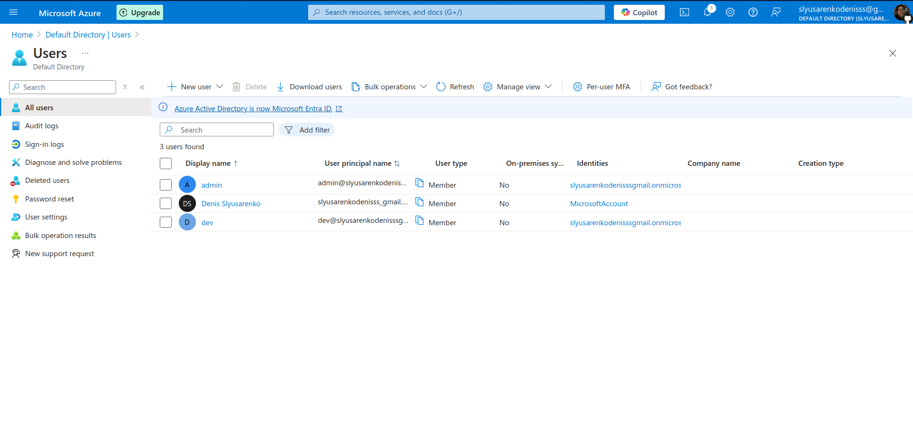
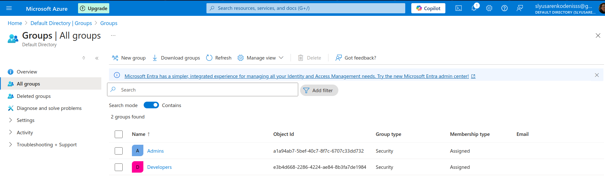
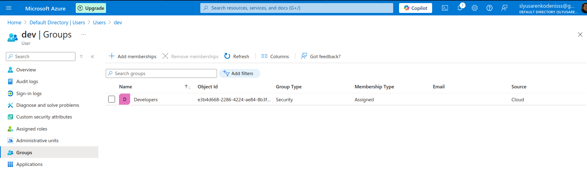

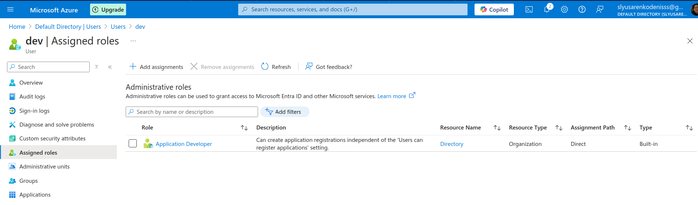
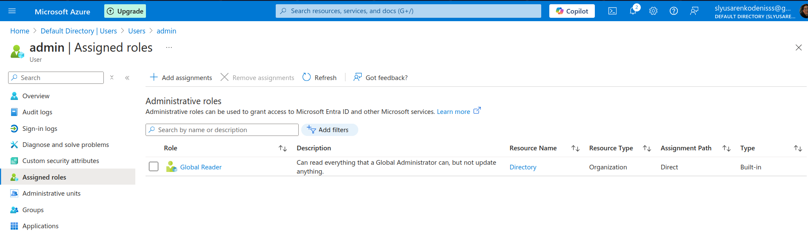

#### 2. Enabling Single Sign-On (SSO) and Multi-Factor Authentication (MFA)

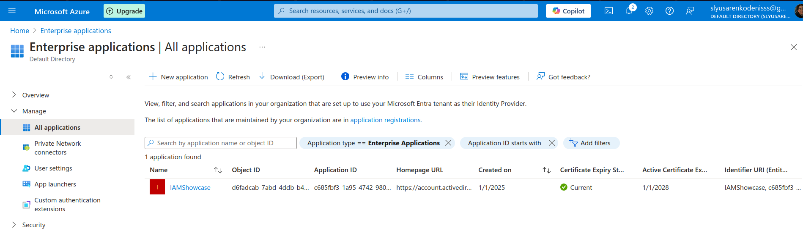
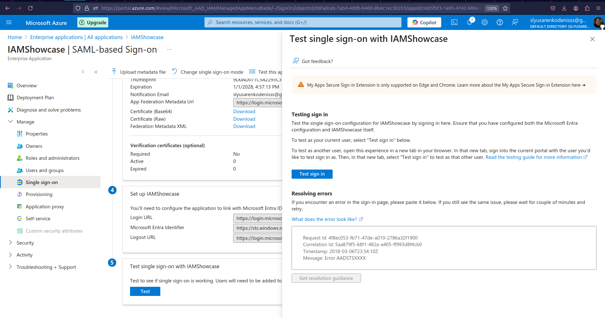
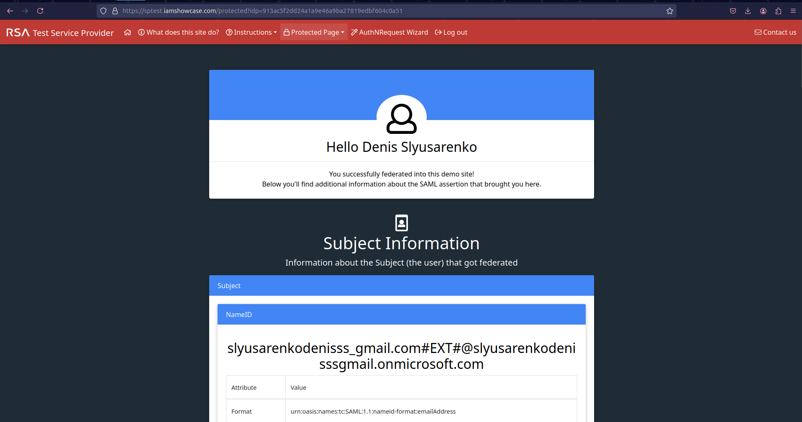
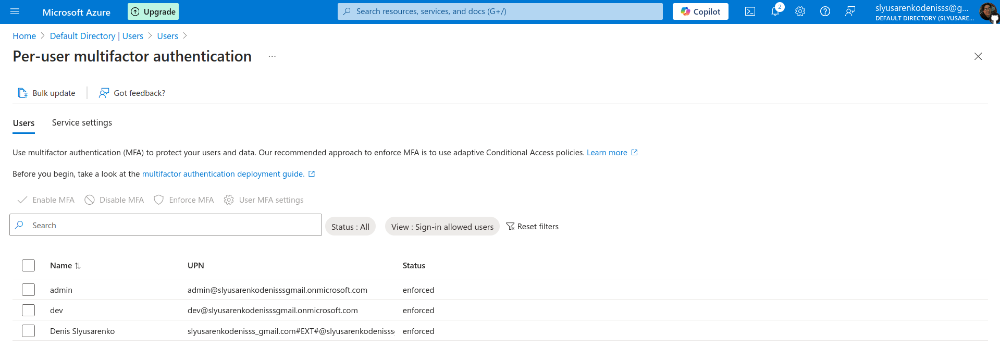

#### 3. Practical Task 3: Implementing Role-Based Access Control (RBAC)
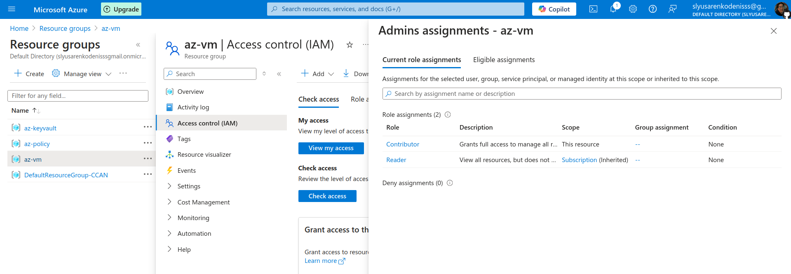
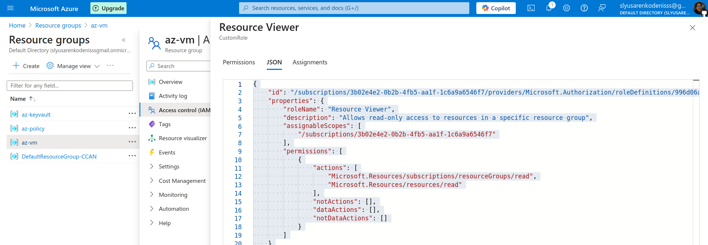
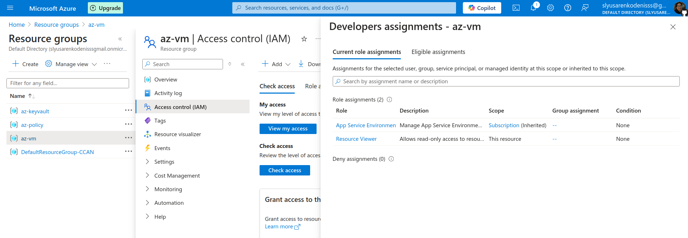

```json
{
    "id": "/subscriptions/3b02e4e2-0b2b-4fb5-aa1f-1c6a9a6546f7/providers/Microsoft.Authorization/roleDefinitions/996d06aa-c806-4d5c-9b1a-6515c9046f9d",
    "properties": {
        "roleName": "Resource Viewer",
        "description": "Allows read-only access to resources in a specific resource group",
        "assignableScopes": [
            "/subscriptions/3b02e4e2-0b2b-4fb5-aa1f-1c6a9a6546f7"
        ],
        "permissions": [
            {
                "actions": [
                    "Microsoft.Resources/subscriptions/resourceGroups/read",
                    "Microsoft.Resources/resources/read"
                ],
                "notActions": [],
                "dataActions": [],
                "notDataActions": []
            }
        ]
    }
}
```

### 4. Securing Sensitive Information with Azure Key Vault
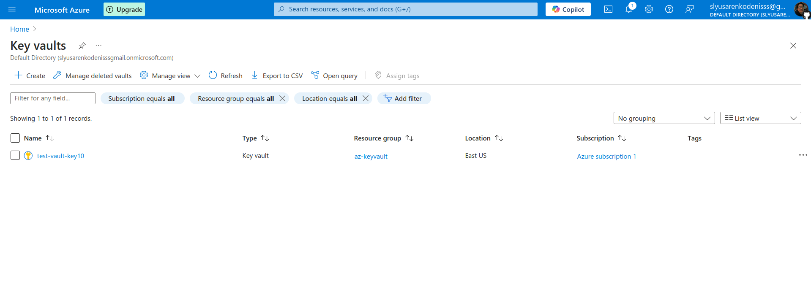
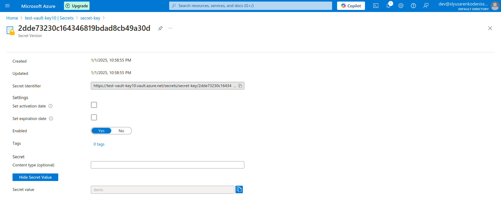
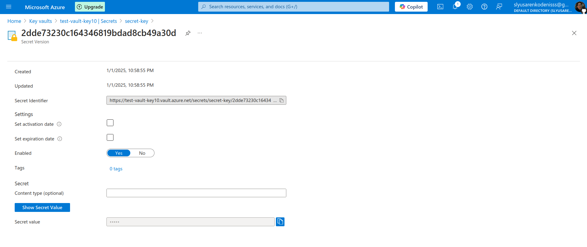
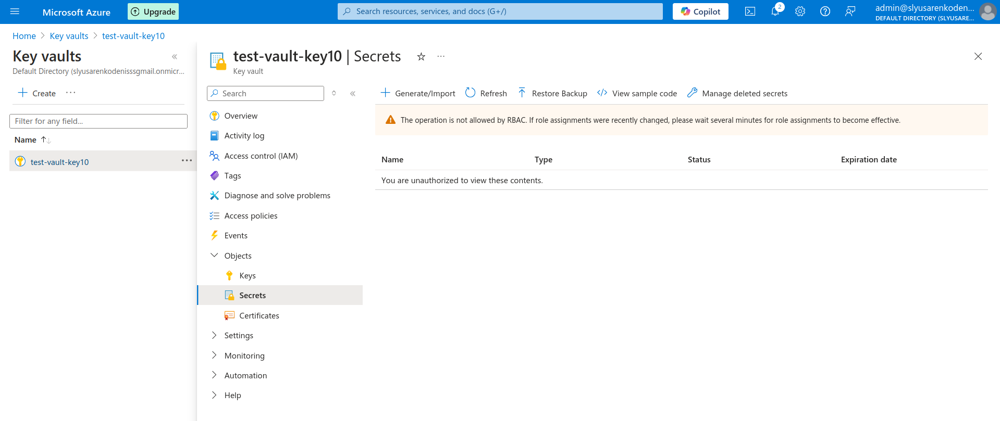

admin user cannot access the key

### 5. Creating and Assigning Basic Azure Policies

```json
{
  "mode": "All",
  "policyRule": {
    "if": {
      "field": "tags['Environment']",
      "exists": "false"
    },
    "then": {
      "effect": "deny"
    }
  },
  "parameters": {}
}
```

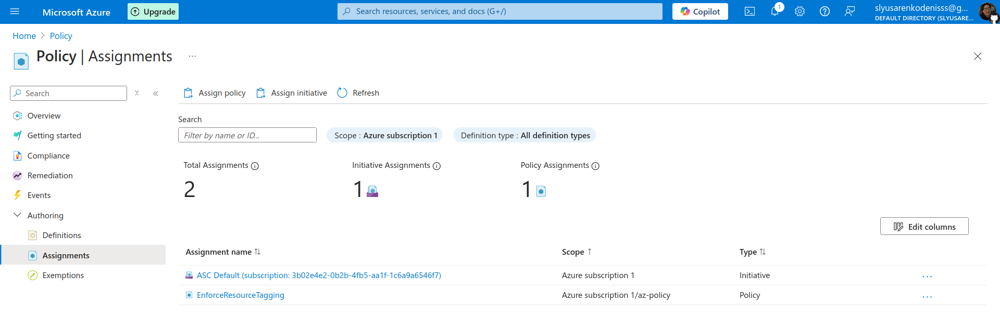
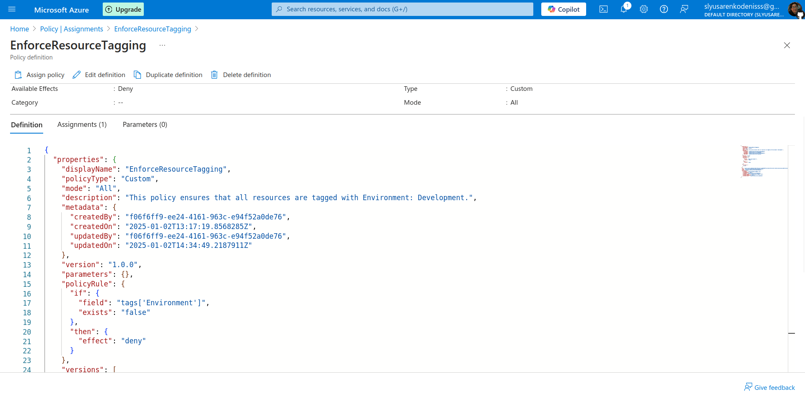
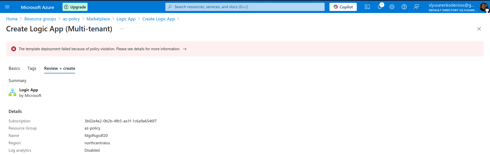
Without the necessary tag, you will not be able to create a resource.

### 6. Using Policy Effects to Enforce Compliance

in progress