# Azure Compute Services Practical tasks

#### Practical Task 1: Linux Virtual Machine Setup and NSG Configuration
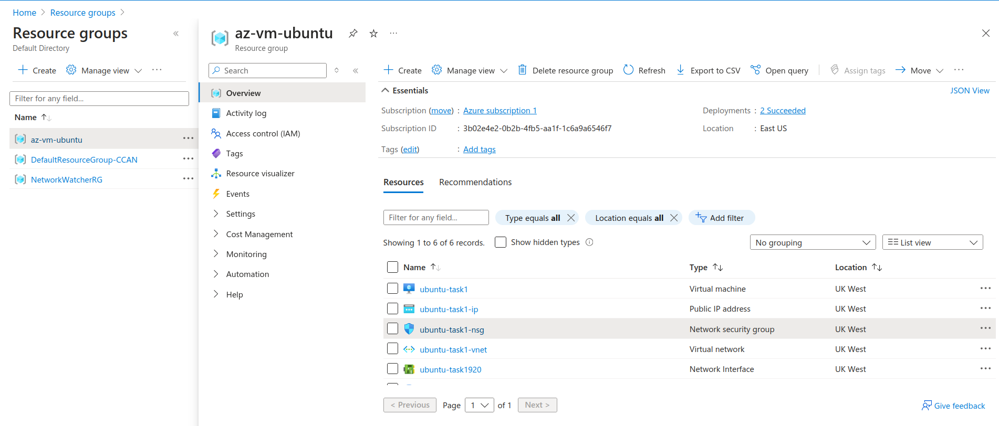
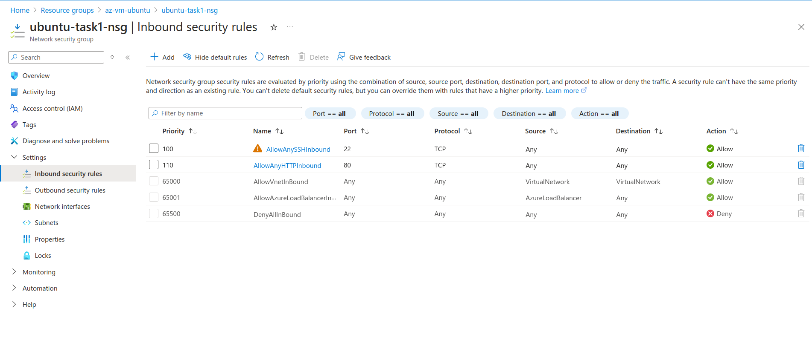
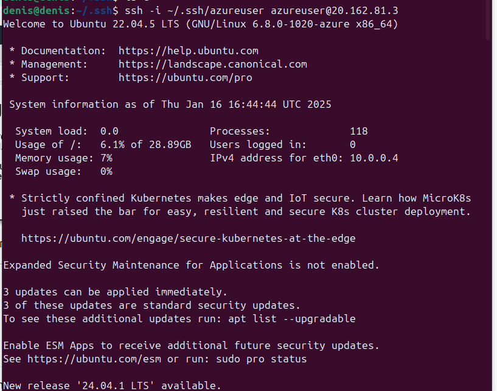
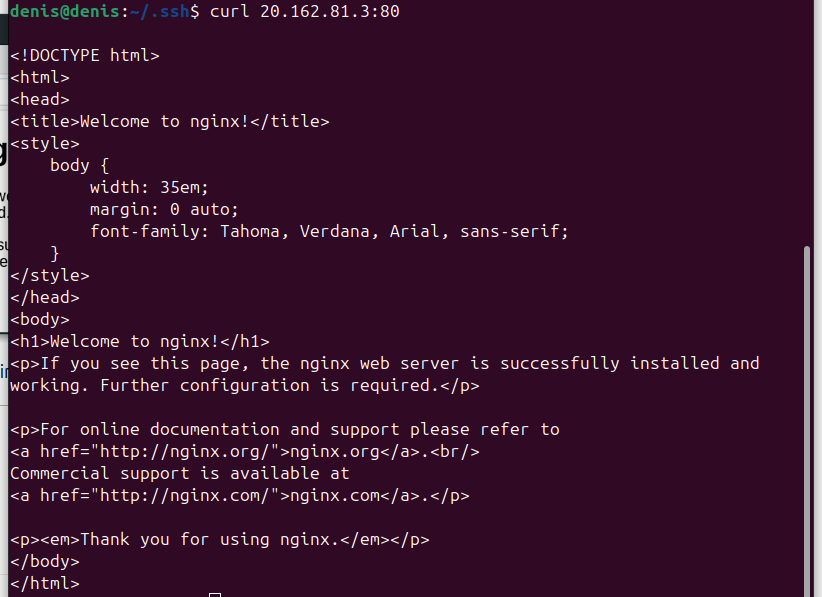

#### Practical Task 2: Windows Virtual Machine and RDP Access Setup

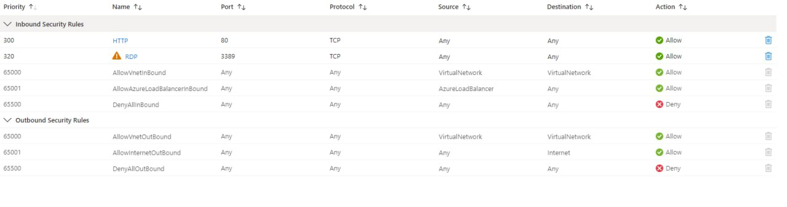
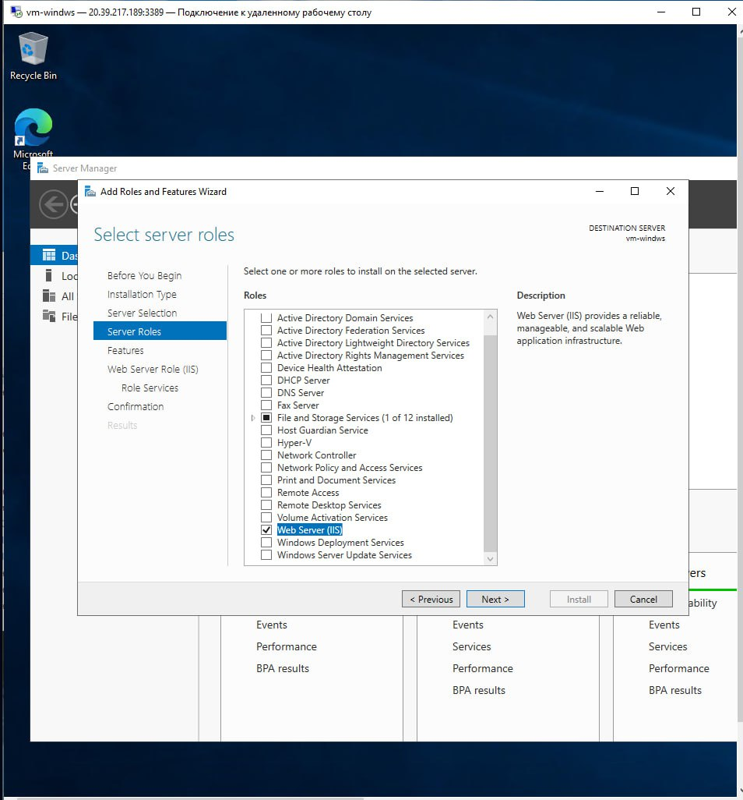
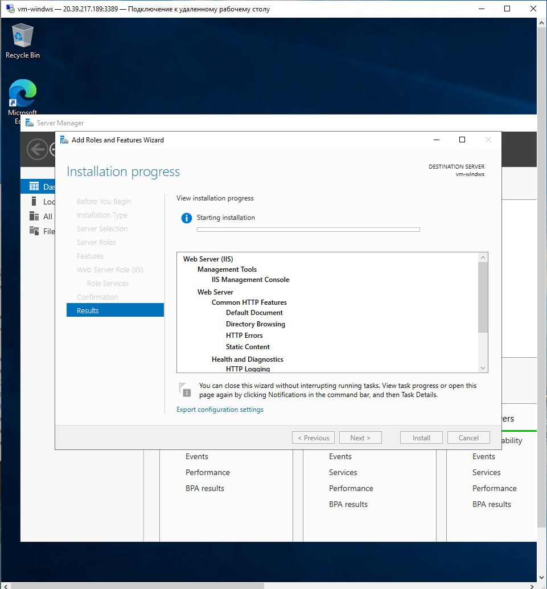
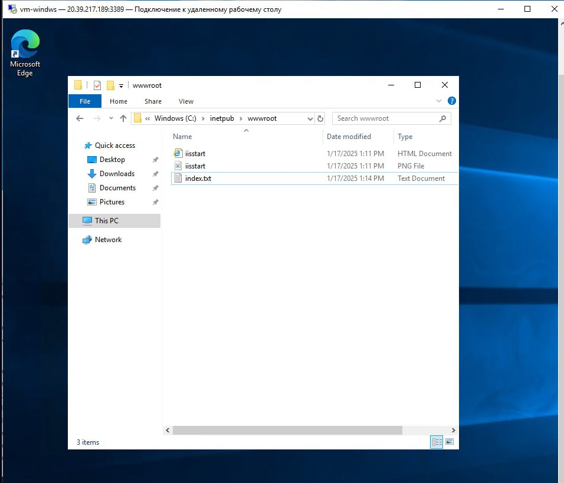
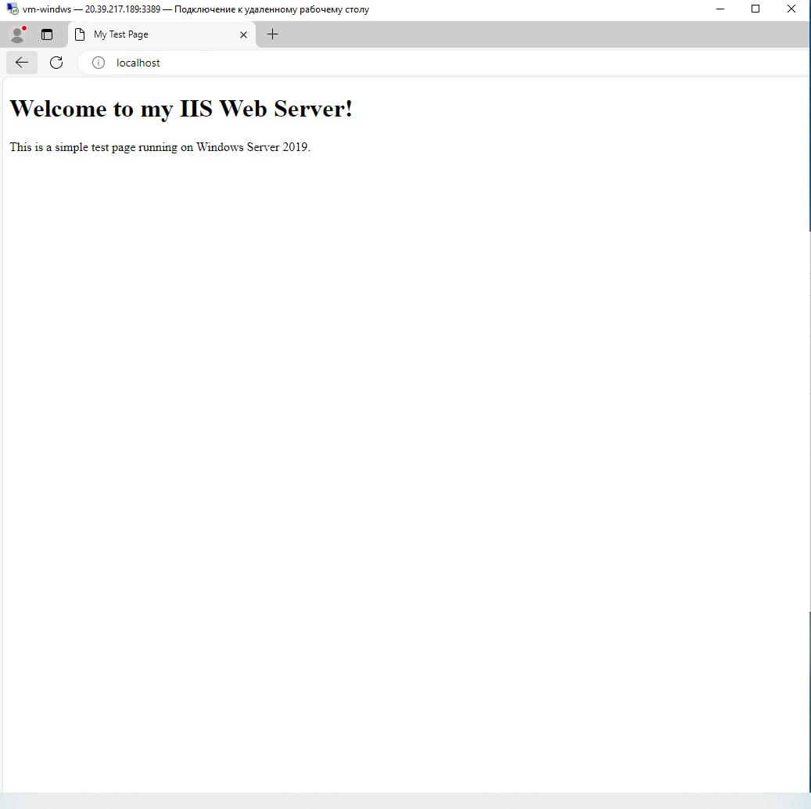

#### Practical Task 3: Configuring an Azure Load Balancer

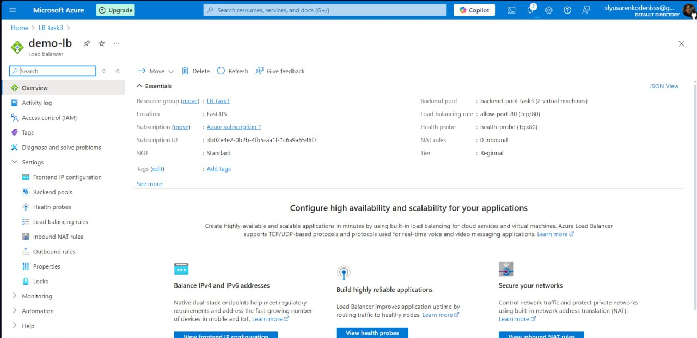
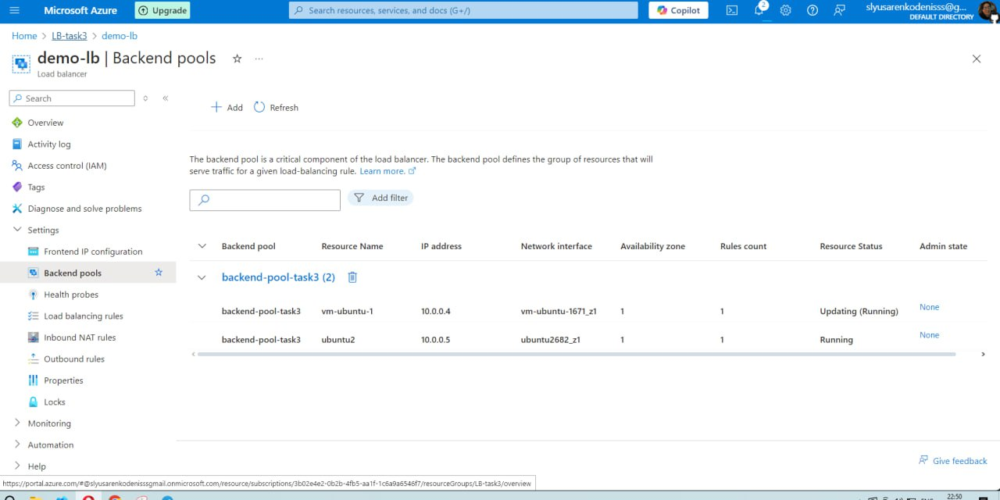
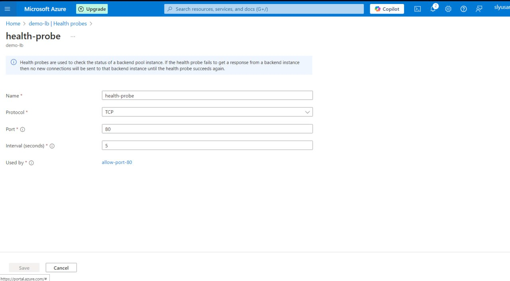
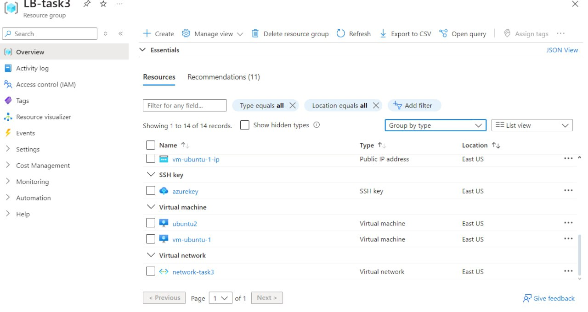
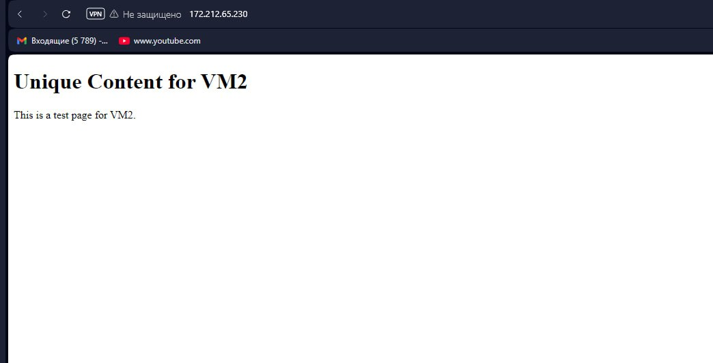
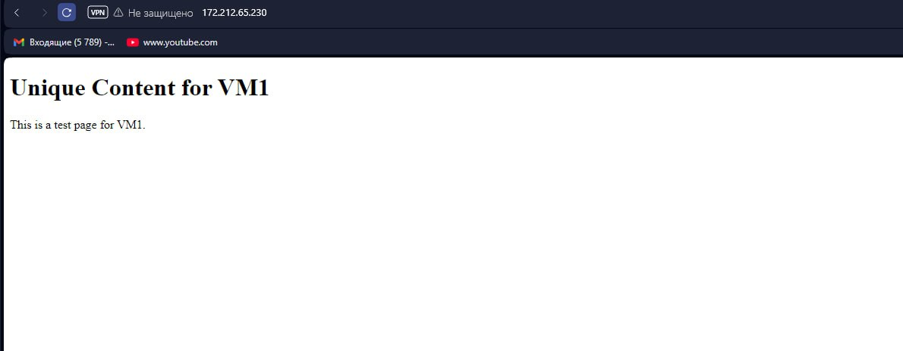

