# Azure Storage and Databases Practical tasks

#### Practical Task 1: Upload and Retrieve Files with Azure Blob Storage
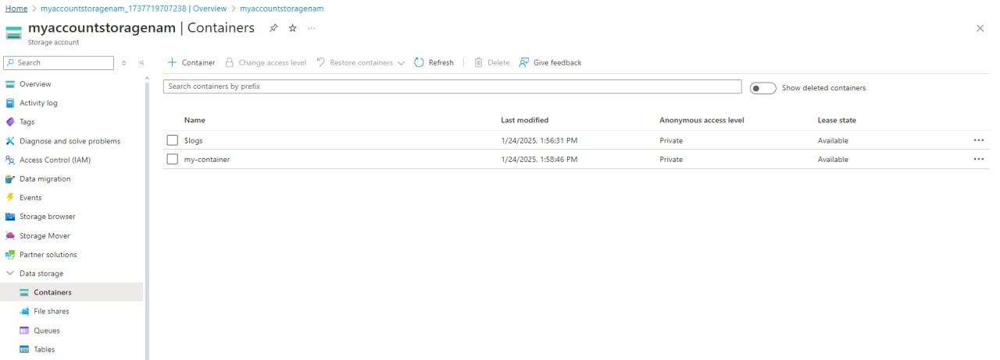
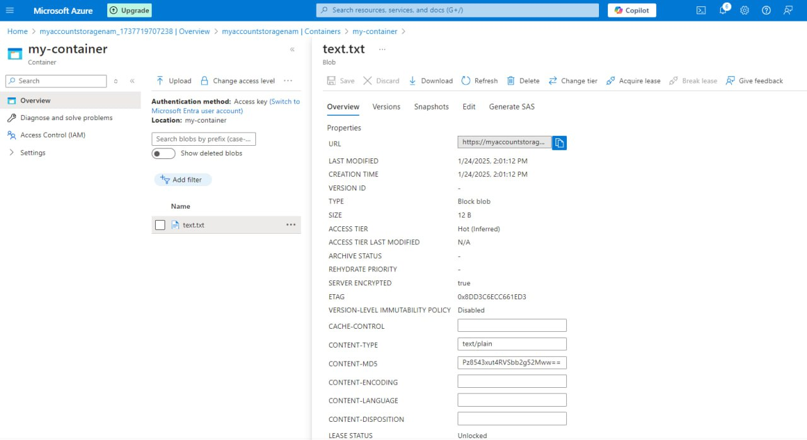

#### Practical Task 2: Lifecycle Management for Blob Storage
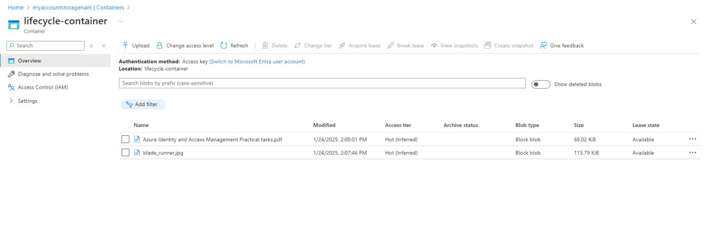
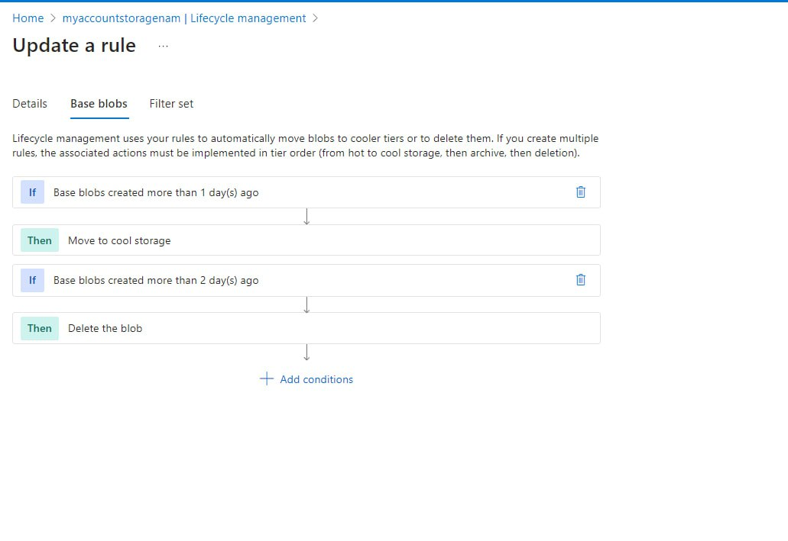
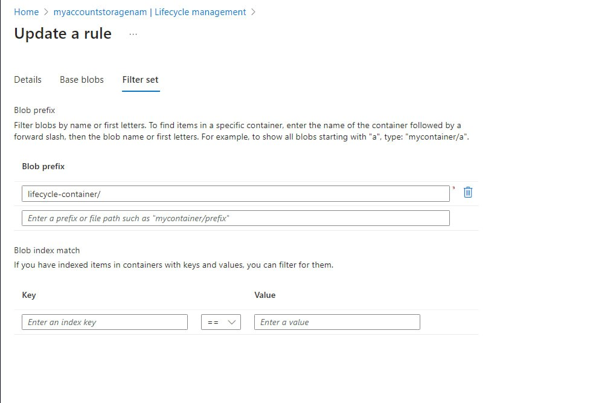
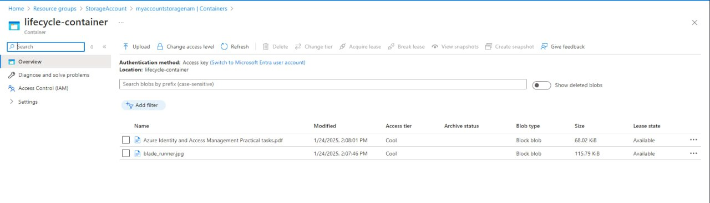

#### Practical Task 3: Implementing an Azure Queue for Message Storage
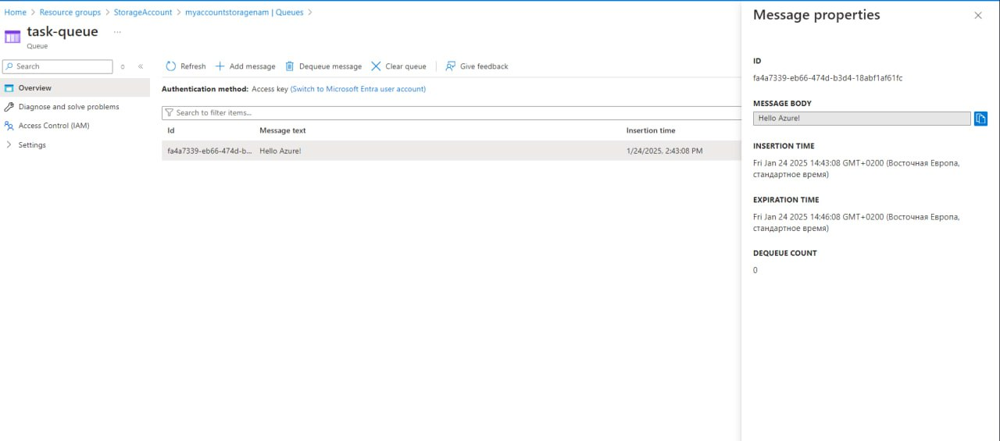
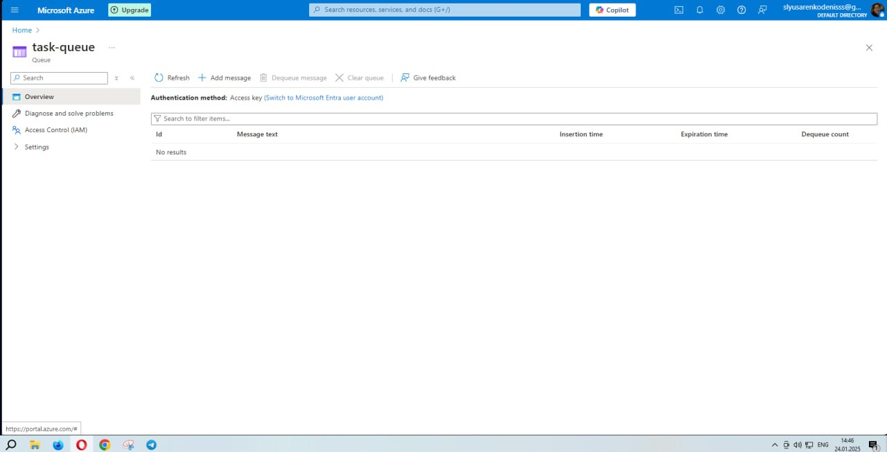

#### Practical Task 4: Configuring Azure File Share and Mounting on a Local Machine
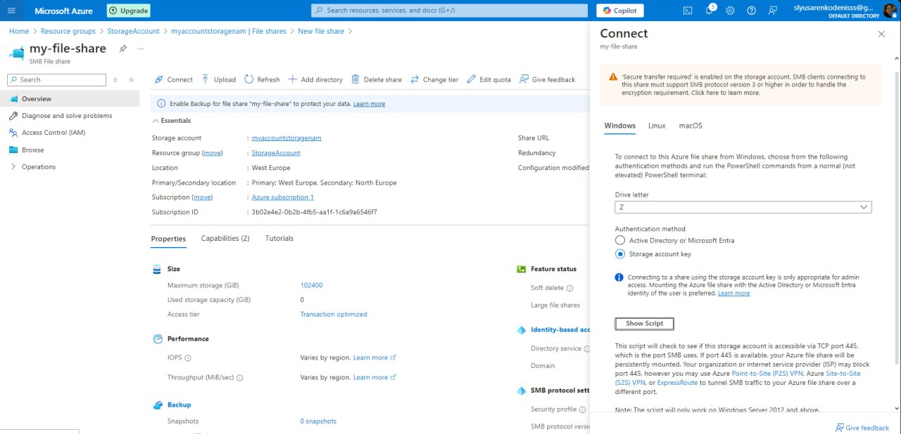
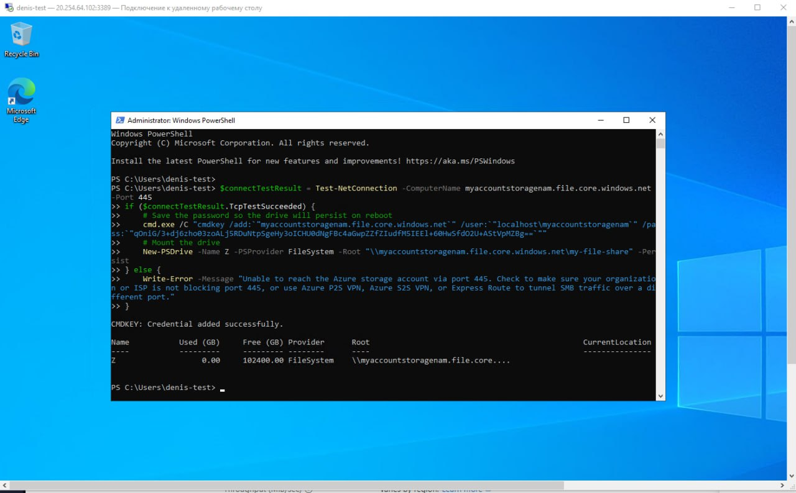
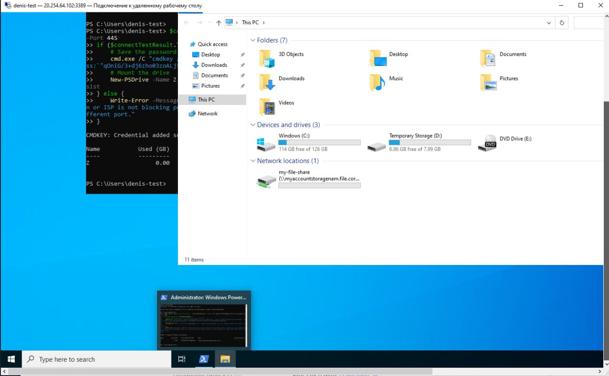
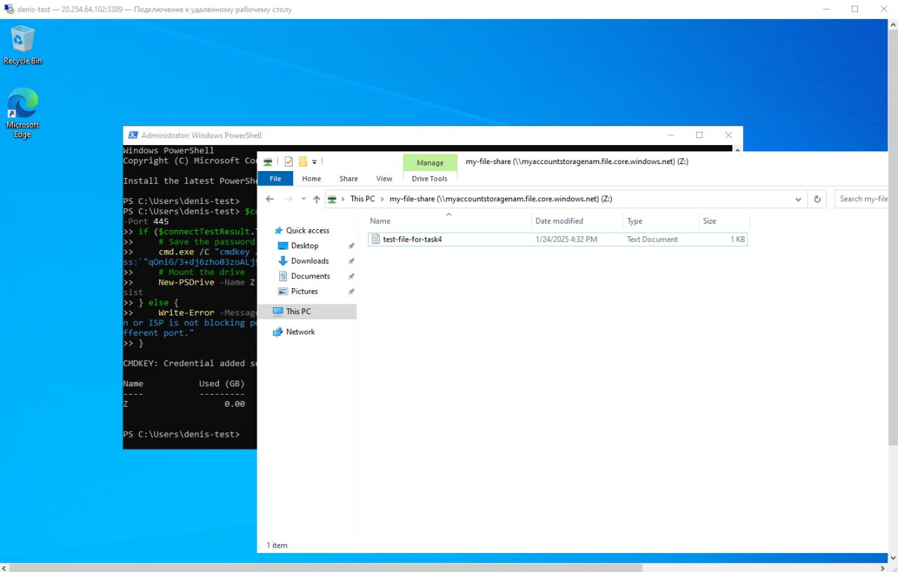
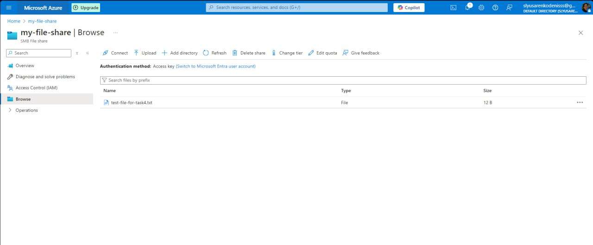