# Azure Storage and Databases Practical tasks

#### Practical Task 1: Upload and Retrieve Files with Azure Blob Storage


#### Practical Task 2: Lifecycle Management for Blob Storage


#### Practical Task 3: Implementing an Azure Queue for Message Storage


#### Practical Task 4: Configuring Azure File Share and Mounting on a Local Machine


#### Practical Task 5: Storing and Querying Data with Azure Table Storage
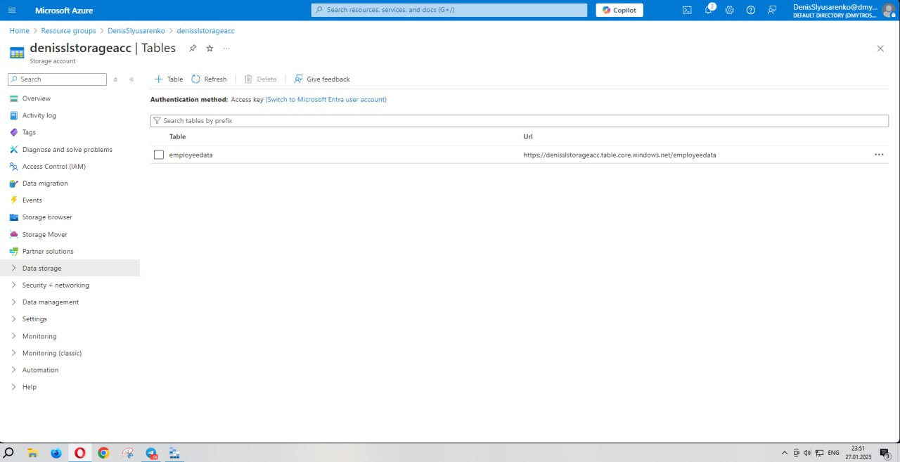
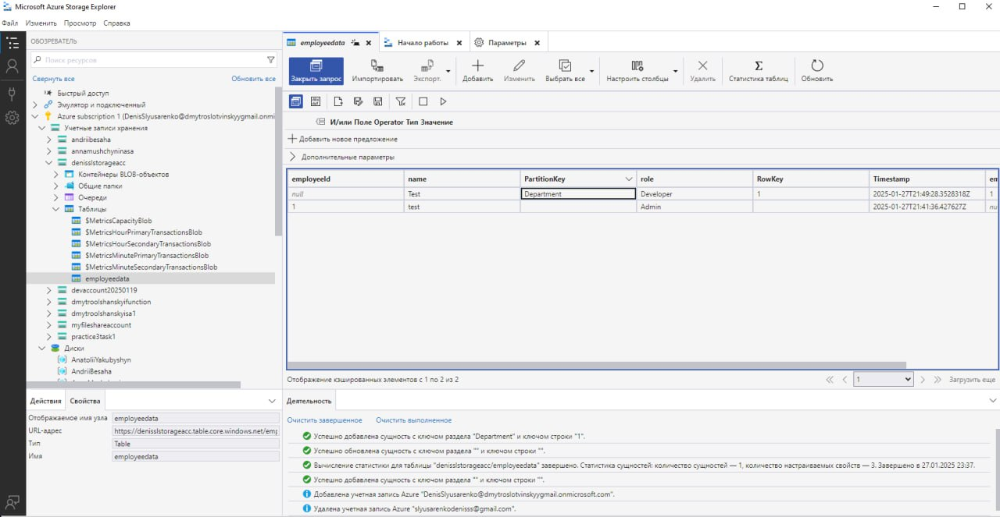
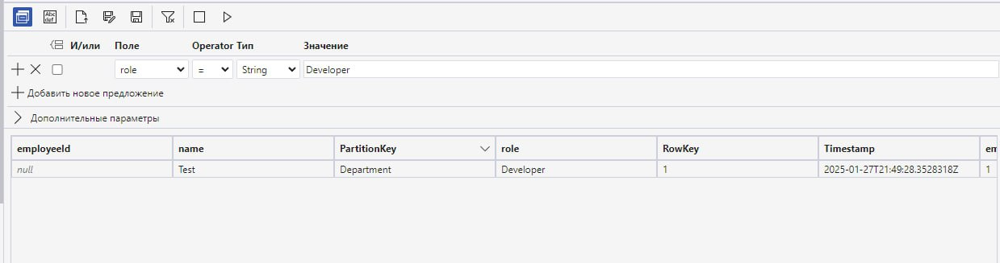


#### Practical Task 6: Configuring Shared Access Signatures (SAS) for Secure Access

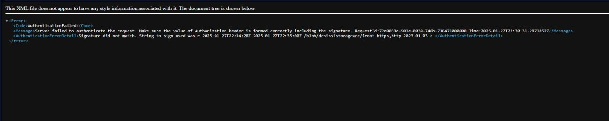
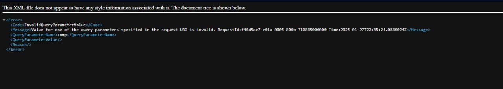

#### Practical Task 7: Implementing Security Best Practices with Azure RBAC and Managed Identities
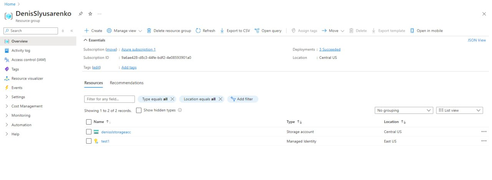
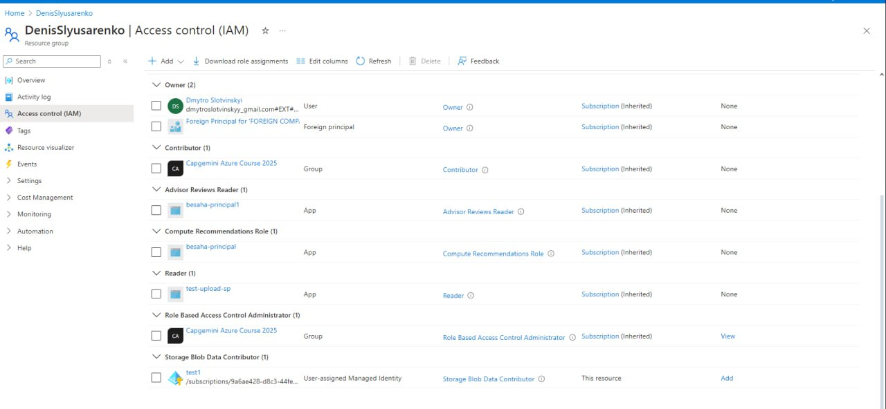
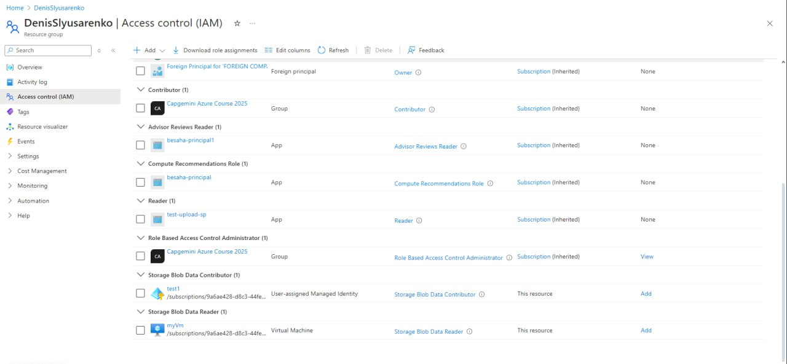
```
azureuser@myVm: az storage blob list --account-name denisslstorageacc --container-name test-cont --auth-mode login
[
  {
    "container": "test-cont",
    "content": "",
    "deleted": null,
    "encryptedMetadata": null,
    "encryptionKeySha256": null,
    "encryptionScope": null,
    "hasLegalHold": null,
    "hasVersionsOnly": null,
    "immutabilityPolicy": {
      "expiryTime": null,
      "policyMode": null
    },
    "isAppendBlobSealed": null,
    "isCurrentVersion": null,
    "lastAccessedOn": null,
    "metadata": {},
    "name": "text.txt",
    "objectReplicationDestinationPolicy": null,
    "objectReplicationSourceProperties": [],
    "properties": {
      "appendBlobCommittedBlockCount": null,
      "blobTier": "Hot",
      "blobTierChangeTime": null,
      "blobTierInferred": true,
      "blobType": "BlockBlob",
      "contentLength": 12,
      "contentRange": null,
      "contentSettings": {
        "cacheControl": null,
        "contentDisposition": null,
        "contentEncoding": null,
        "contentLanguage": null,
        "contentMd5": "Pz8543xut4RVSbb2g52Mww==",
        "contentType": "text/plain"
      },
      "copy": {
        "completionTime": null,
        "destinationSnapshot": null,
        "id": null,
        "incrementalCopy": null,
        "progress": null,
        "source": null,
        "status": null,
        "statusDescription": null
      },
      "creationTime": "2025-01-27T22:19:49+00:00",
      "deletedTime": null,
      "etag": "0x8DD3F20B689C9A2",
      "lastModified": "2025-01-27T22:19:49+00:00",
      "lease": {
        "duration": null,
        "state": "available",
        "status": "unlocked"
      },
      "pageBlobSequenceNumber": null,
      "pageRanges": null,
      "rehydrationStatus": null,
      "remainingRetentionDays": null,
      "serverEncrypted": true
    },
    "rehydratePriority": null,
    "requestServerEncrypted": null,
    "snapshot": null,
    "tagCount": null,
    "tags": null,
    "versionId": null
  }
]
```

```
azureuser@myVm:~$ az login --identity
[
  {
    "environmentName": "AzureCloud",
    "homeTenantId": "",
    "id": "",
    "isDefault": true,
    "managedByTenants": [],
    "name": "Azure subscription 1",
    "state": "Enabled",
    "tenantId": "",
    "user": {
      "assignedIdentityInfo": "MSI",
      "name": "systemAssignedIdentity",
      "type": "servicePrincipal"
    }
  }
]
```
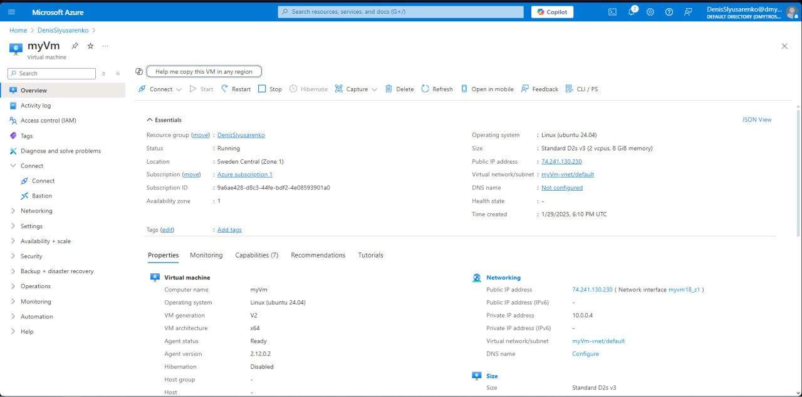

#### Practical Task 8: Creating and Querying an Azure SQL Database
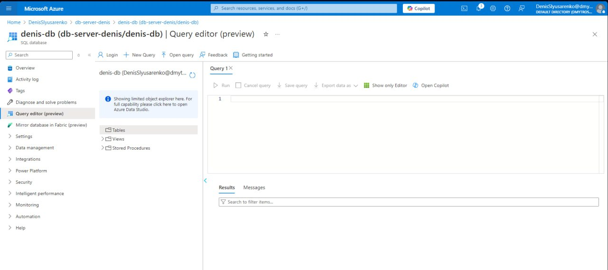
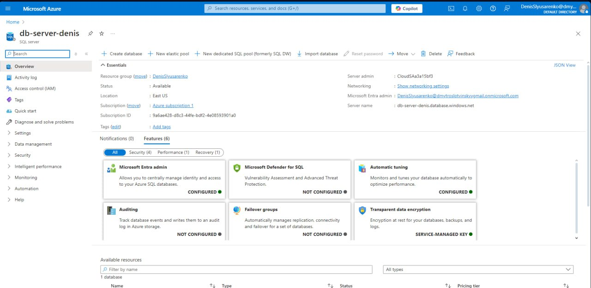
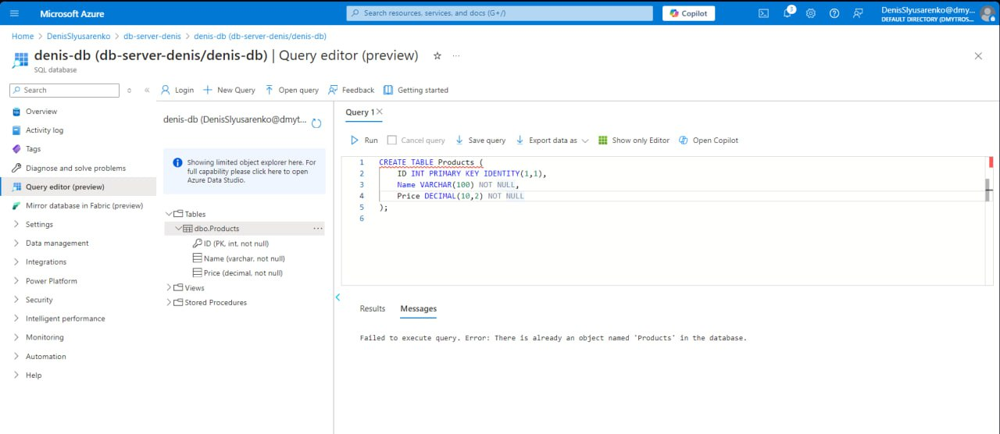
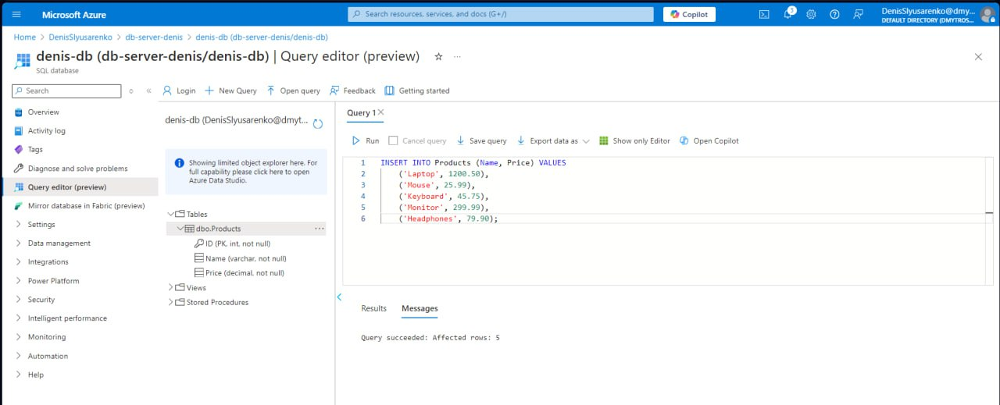
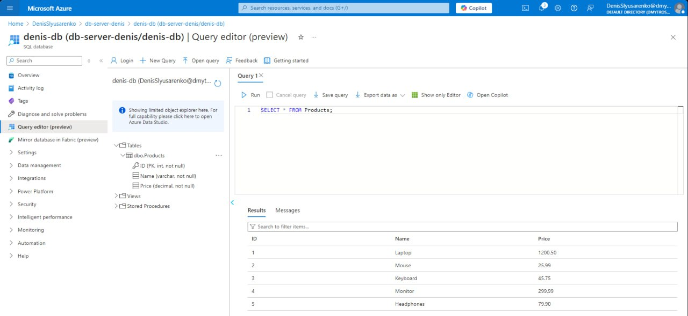

#### Practical Task 9: Deploying an Azure SQL Database with Automated Backup Configuration
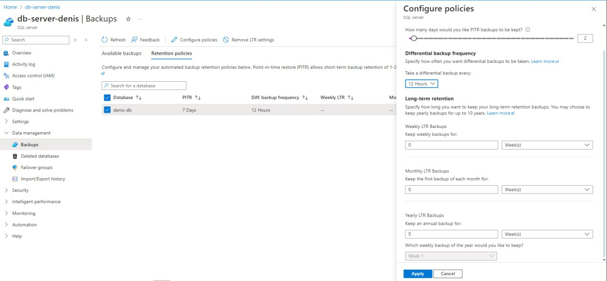
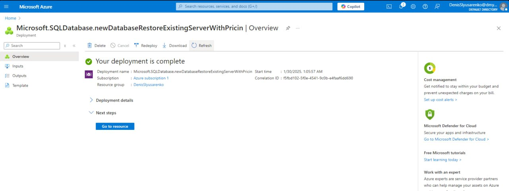
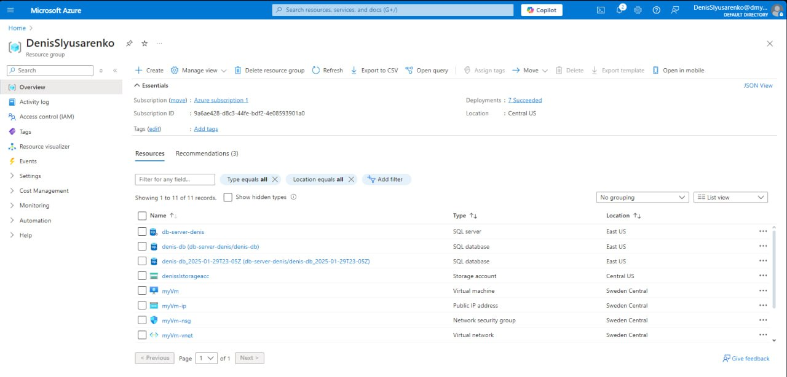
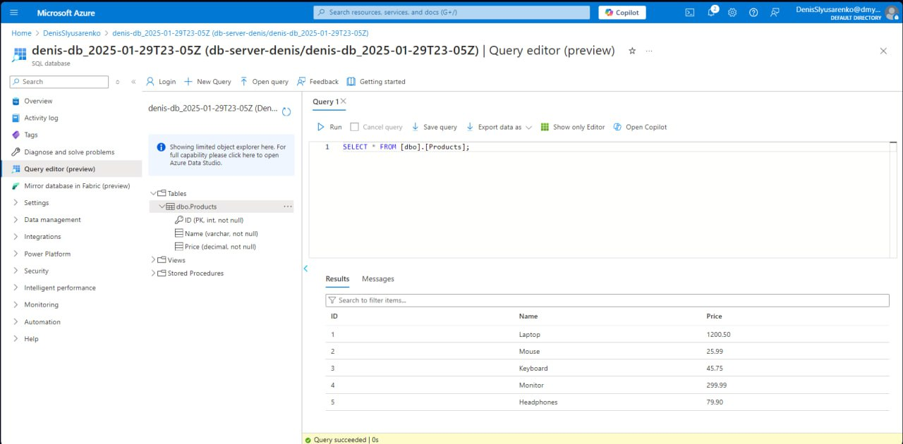
#### Practical Task 10: Getting Started with Cosmos DB
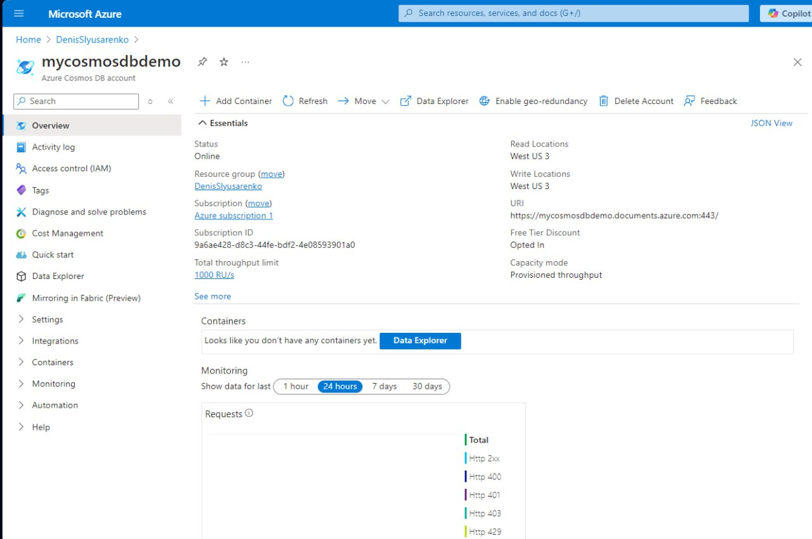
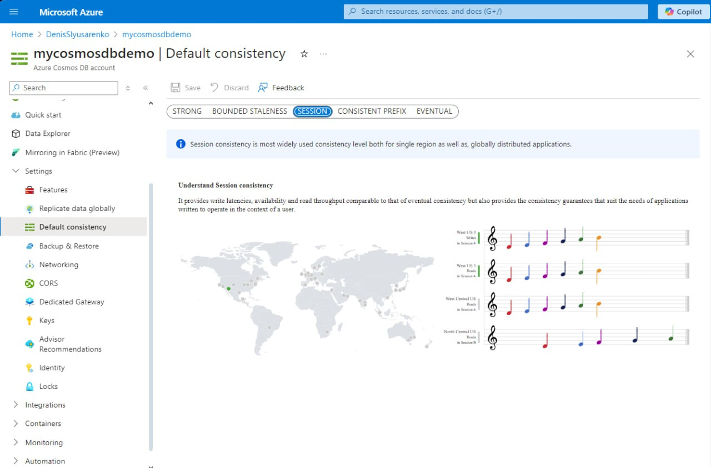
```
PS /home/denis> az cosmosdb keys list -n mycosmosdbdemo -g DenisSlyusarenko 
[Warning] This output may compromise security by showing the following secrets: primaryReadonlyMasterKey, secondaryMasterKey, secondaryReadonlyMasterKey, primaryMasterKey. Learn more at: https://go.microsoft.com/fwlink/?linkid=2258669
{
  "primaryMasterKey": "",
  "primaryReadonlyMasterKey": "",
  "secondaryMasterKey": "",
  "secondaryReadonlyMasterKey": ""
}
```
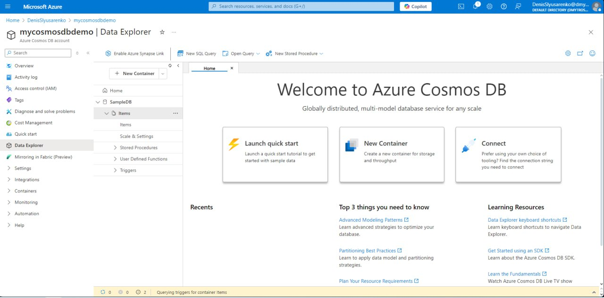
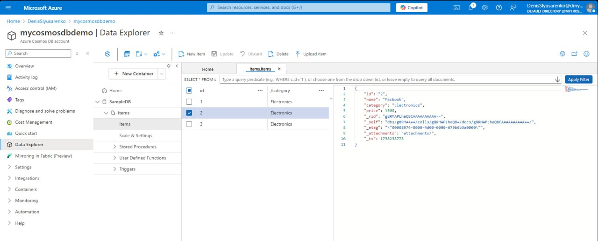
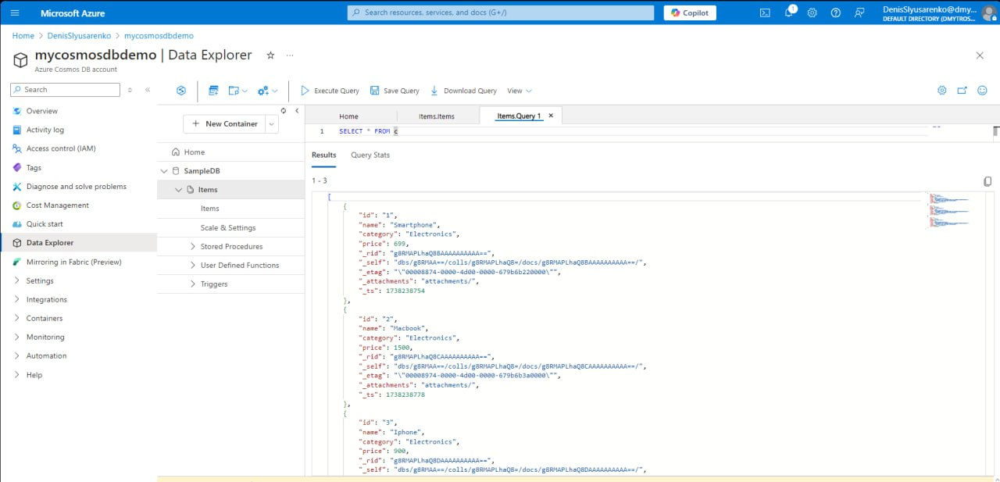

```
If Partition Key is used in WHERE, the costs are lower.
If not, it is higher because Cosmos DB scans all partitions.
```
```
Cosmos DB has 5 levels of consistency that affect latency and data integrity guarantees:

Strong - Data is always the freshest, but high latency.
Bounded Staleness - Data can lag, but only within a fixed time/record.
Session (📌 default) - The reading user sees their most recent changes.
Consistent Prefix - Ensures that the order of operations is not disrupted, but there may be a delay.
Eventual - Lowest latency, but data may not arrive immediately and in different order.
```
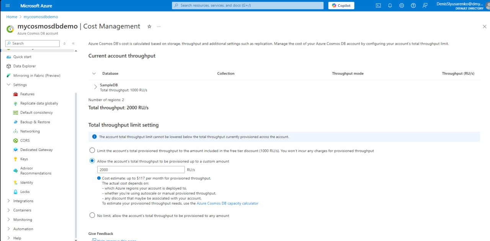
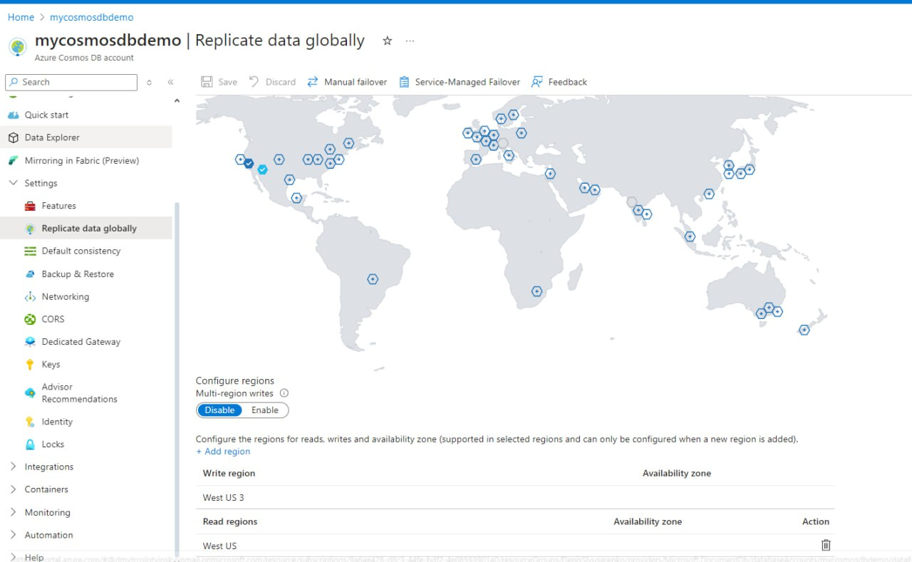
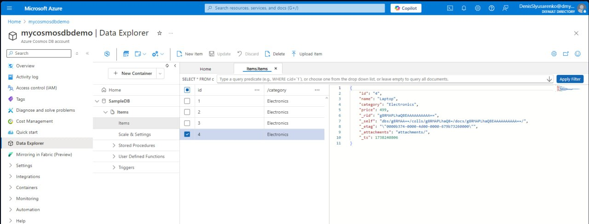
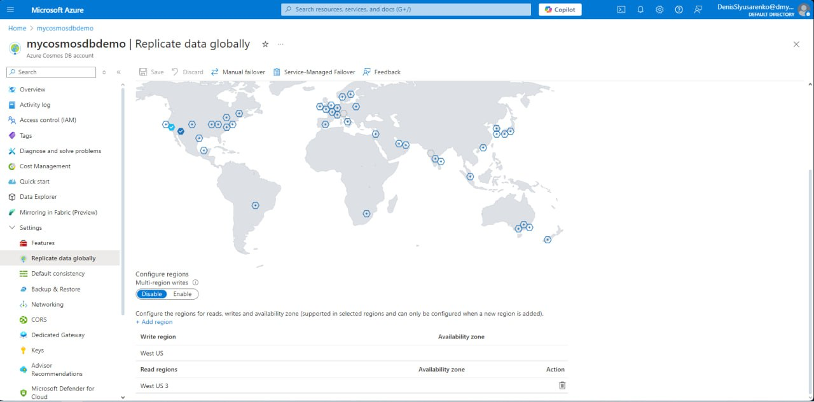
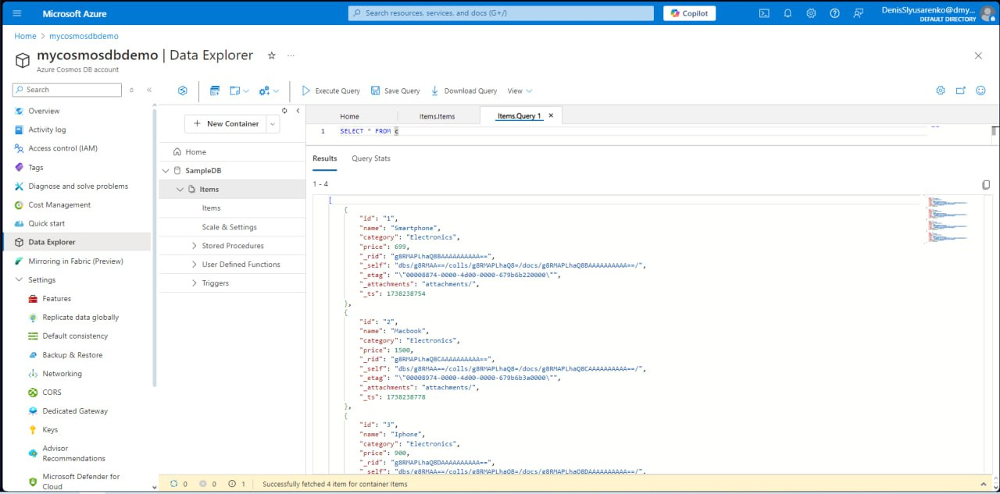
