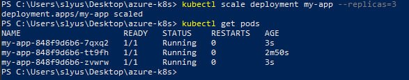

# Azure Containerization and Orchestration

#### Practical Task 1: Deploy a Docker Container to Azure Container Instances (ACI) via Azure Portal


To build and publish a docker image to the Azure container registry, you need to run the following commands:
```
docker build -t <your_registry>.azurecr.io/<app_name>:latest .
```

Login to Azure and Azure acr:
```
az login
az acr login --name <your_registry>
```

Docker push:
```
docker push <your_registry>.azurecr.io/<app_name>:latest
```

Python code
```
import os
from flask import Flask

app = Flask(__name__)

APP_MESSAGE = os.getenv("APP_MESSAGE", "Default Message")
PORT = int(os.getenv("PORT", 8000))

@app.route("/")
def home():
    return f"Message: {APP_MESSAGE}"

if __name__ == "__main__":
    app.run(host="0.0.0.0", port=PORT)
```
Docker file
```
FROM python:3.12-alpine

RUN apk add --no-cache gcc musl-dev libffi-dev

WORKDIR /app

COPY requirements.txt .
RUN pip install --no-cache-dir -r requirements.txt

COPY . .

CMD ["python", "app.py"]
```

#### Practical Task 2: Configure Environment Variables in ACI via Azure Portal


#### Practical Task 3: Scale Out with Azure Container Instances via Azure Portal


#### Practical Task 4: Secure a Docker Container in ACI with Managed Identity via Azure Portal


```python
from flask import Flask
import os
from azure.identity import DefaultAzureCredential
from azure.keyvault.secrets import SecretClient

app = Flask(__name__)

keyvault_name = os.environ["KEY_VAULT_NAME"]

secret_name = os.environ["SECRET_NAME"]

keyvault_url = ""
credential = DefaultAzureCredential()
client = SecretClient(vault_url=keyvault_url, credential=credential)

@app.route('/')
def hello():
    retrieved_secret = client.get_secret(secret_name)
    return f'Secret value: {retrieved_secret.value}'

if __name__ == '__main__':
    app.run(host='0.0.0.0', port=80)
```

```
FROM python:3.12-alpine

RUN apk add --no-cache gcc musl-dev libffi-dev

WORKDIR /app

COPY requirements.txt .
RUN pip install --no-cache-dir -r requirements.txt 

COPY . .

EXPOSE 80

CMD ["python", "app.py"]

```

#### Practical Task 5: Deploy a Kubernetes Cluster with AKS via Azure Portal


```
az container show --resource-group <RS-name> --name <container-name> --query identity.principalId --output tsv
```


```
az aks get-credentials --resource-group DenisSlyusarenko --name KS-deniscluster --overwrite-existing
```


```
yaml 
apiVersion: apps/v1
kind: Deployment
metadata:
  name: nginx-app
  labels:
    app: nginx
spec:
  replicas: 1
  selector:
    matchLabels:
      app: nginx
  template:
    metadata:
      labels:
        app: nginx
    spec:
      containers:
      - name: nginx
        image: nginx:alpine
        ports:
        - containerPort: 80

```

```
apiVersion: v1
kind: Service
metadata:
  name: nginx-service
spec:
  selector:
    app: nginx
  ports:
    - protocol: TCP
      port: 80
      targetPort: 80
  type: LoadBalancer
```

#### Practical Task 6: Deploy a Containerized Application on AKS


#### Practical Task 7: Configure and Use ConfigMaps and Secrets in AKS

```
apiVersion: apps/v1
kind: Deployment
metadata:
  name: node-app
  labels:
    app: node-app
spec:
  replicas: 1
  selector:
    matchLabels:
      app: node-app
  template:
    metadata:
      labels:
        app: node-app
    spec:
      containers:
      - name: node-app
        image: denisregistry.azurecr.io/nodejsapp:latest
        ports:
          - containerPort: 3000
        imagePullPolicy: Always
        env:
          - name: PORT
            value: "3000"
        
          - name: ENVIRONMENT
            valueFrom:
              configMapKeyRef:
                name: config-data
                key: environment
          - name: LOG_LEVEL
            valueFrom:
              configMapKeyRef:
                name: config-data
                key: log_level
          - name: DB_PASSWORD
            valueFrom:
              secretKeyRef:
                name: mysecret
                key: password
```

```
apiVersion: v1
kind: Secret
metadata:
  name: mysecret
type: Opaque
data:
  password: <pass>
```

```
apiVersion: v1
kind: ConfigMap
metadata:
  name: config-data
data:
  environment: "production"
  log_level: "info"
```

#### Practical Task 8: Scale Applications in AKS





```
apiVersion: apps/v1
kind: Deployment
metadata:
  name: my-app
  labels:
    app: my-app
spec:
  replicas: 1
  selector:
    matchLabels:
      app: my-app
  template:
    metadata:
      labels:
        app: my-app
    spec:
      containers:
      - name: my-app
        image: nginx:latest
        ports:
          - containerPort: 80
        imagePullPolicy: Always
        resources:
          requests:
            cpu: "100m"
            memory: "128Mi"
          limits:
            cpu: "250m"
            memory: "256Mi"
```

#### Practical Task 9: Rolling Update of an Application in AKS


```
 kubectl set image deployment/my-app my-app=<registry>.azurecr.io/<app>:v2
```


#### Bonus task. GitOps with AKS

##### Deploy ArgoCD on AKS
```
kubectl create namespace argocd

kubectl apply -n argocd -f https://raw.githubusercontent.com/argoproj/argo-cd/stable/manifests/install.yaml
```
##### Change the argocd-server service type to LoadBalancer:
```
kubectl patch svc argocd-server -n argocd -p '{"spec": {"type": "LoadBalancer"}}'
```

The initial password for the admin account is auto-generated and stored as clear text in the field password in a secret named argocd-initial-admin-secret in your Argo CD installation namespace. You can simply retrieve this password using kubectl
```
kubectl -n argocd get secret argocd-initial-admin-secret -o jsonpath="{.data.password}" | base64 -d; echo
```


