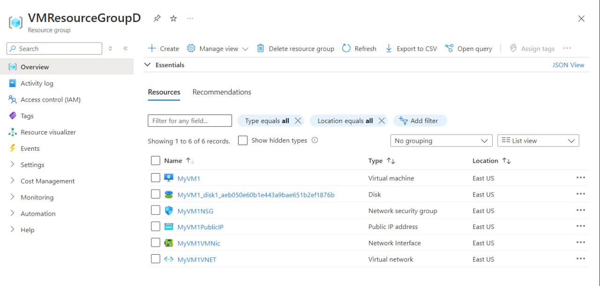
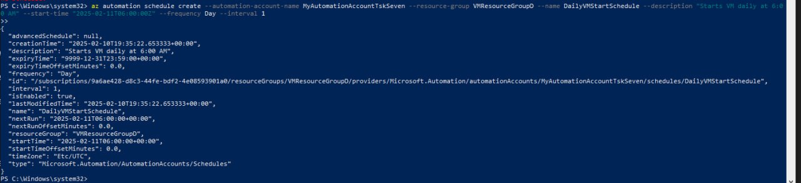

#### Practical Task 1: Install and Configure Azure CLI and PowerShell


```
az account list
```

```
Get-AzSubscription
```
#### Practical Task 2: Create and Manage Resource Groups


```
az group create --name MyResourceGroupD --location eastus
```

```
New-AzResourceGroup -Name MyPSResourceGroupDD -Location "West Europe"

az group list --output table
Get-AzResourceGroup
```


```
az group delete --name MyResourceGroupD --yes --no-wait
Remove-AzResourceGroup -Name MyPSResourceGroupDD -Force
```
#### Practical Task 3: Deploy and Manage Virtual Machines using Azure CLI and PowerShell


```
az vm create --resource-group VMResourceGroupD --name MyVM1 --image Ubuntu2204 --admin-username azureuser --generate-ssh-keys
```

```
New-AzVM -ResourceGroupName "VMResourceGroupD" -Name "MyVM2" -Location "East US" -Image "Ubuntu2204" -Credential (Get-Credential)
```


```
az vm show --resource-group VMResourceGroupD --name MyVM1 --output table
Get-AzVM -ResourceGroupName "VMResourceGroupD" -Name "MyVM1"
```

```
az vm stop --resource-group VMResourceGroupD --name MyVM1
Stop-AzVM -ResourceGroupName "VMResourceGroupD" -Name "MyVM2" -Force
```


```
az vm delete --resource-group VMResourceGroupD --name MyVM1 --yes
Remove-AzVM -ResourceGroupName "VMResourceGroupD" -Name "MyVM2" -Force
```

#### Practical Task 4: Manage Storage Accounts using Azure CLI and PowerShell


```
New-AzStorageAccount -ResourceGroupName "VMResourceGroupD" -Name "mystorageps" -Location "West Europe" -SkuName "Standard_LRS"

az storage account create --name mystorageclid --resource-group VMResourceGroupD --location eastus --sku Standard_LRS
```

```
az storage account list --output table
Get-AzStorageAccount
```


```
az storage account show-connection-string --name mystorageclid --resource-group VMResourceGroupD --output tsv
(Get-AzStorageAccountKey -ResourceGroupName "VMResourceGroupD" -Name "mystorageps")[0].Value
```


#### Practical Task 5: Assign Role-Based Access Control (RBAC) Roles


```
az role assignment create --assignee DenisSlyusarenko@dmytroslotvinskyygmail.onmicrosoft.com --role "Reader" --scope /subscriptions/9a6ae428-d8c3-44fe-bdf2-4e08593901a0/resourceGroups/VMResourceGroupD
```

```
$storageAccount = Get-AzStorageAccount -ResourceGroupName "VMResourceGroupD" -Name "mystorageclid"
>> $storageAccountId = $storageAccount.Id

New-AzRoleAssignment -ObjectId (Get-AzADUser -UserPrincipalName "DenisSlyusarenko@dmytroslotvinskyygmail.onmicrosoft.com").Id -RoleDefinitionName "Contributor" -Scope $storageAccountId
```


```
az role assignment delete --assignee DenisSlyusarenko@dmytroslotvinskyygmail.onmicrosoft.com --role "Contributor" --scope "/subscriptions/9a6ae428-d8c3-44fe-bdf2-4e08593901a0/resourceGroups/VMResourceGroupD/providers/Microsoft.Storage/storageAccounts/mystorageclid"

Remove-AzRoleAssignment -SignInName "DenisSlyusarenko@dmytroslotvinskyygmail.onmicrosoft.com" -RoleDefinitionName "Reader" -ResourceGroupName "VMResourceGroupD"
```


#### Practical Task 7: Create and Run an Azure Automation Runbook


```
az automation runbook create --name StartAzureVMRunbook --automation-account-name MyAutomationAccountTskSeven --resource-group VMResourceGroupD --type PowerShell

az automation account create --automation-account-name "MyAutomationAccountTskSeven" --location "East US" --sku "Free" --resource-group VMResourceGroupD
```



```
az automation runbook create --name StartAzureVMRunbook --automation-account-name MyAutomationAccountTskSeven --resource-group VMResourceGroupD --schedule-name DailyVMStartSchedule
```


#### Practical Task 8: Automate Resource Cleanup Using a PowerShell Runbook


```
Connect-AzAccount -Identity

# Define parameters
$ResourceGroupName = "VMResourceGroupD"
$DaysUnused = 3
$CutoffDate = (Get-Date).AddDays(-$DaysUnused)

# Get all resources in the resource group
$resources = Get-AzResource -ResourceGroupName $ResourceGroupName

# Initialize array to store unused resources
$unusedResources = @()

foreach ($resource in $resources) {
    # Get activity logs for the resource for the past 30 days
    $activityLogs = Get-AzLog -ResourceId $resource.Id -StartTime $CutoffDate -EndTime (Get-Date) -WarningAction SilentlyContinue
    
    # If no activity logs are found, consider the resource unused
    if (-not $activityLogs) {
        $unusedResources += $resource
    }
}

# Output unused resources
if ($unusedResources.Count -gt 0) {
    Write-Output "Unused resources in resource group '$ResourceGroupName' (last $DaysUnused days):"
    $unusedResources | Select-Object Name, ResourceType, Location | Format-Table -AutoSize
} else {
    Write-Output "No unused resources found in resource group '$ResourceGroupName' in the last $DaysUnused days."
}
```


```
az rest --method post --uri "" --headers "Content-Type=application/json"
```

#### Practical Task 9: Implement Desired State Configuration (DSC) to Enforce VM Settings


#### Practical Task 10: Automate Multi-Resource Deployment and Configuration Using Runbooks and DSC


```
param (
    [string]$ResourceGroupName = "VMResourceGroupD",
    [string]$VMName = "WebServerVM",
    [string]$Location = "EastUS",
    [string]$AdminUsername = "azureuser",
    [string]$AdminPassword = "ggq2E9pH6EimNsX",
    [string]$DiskName = "WebServerDisk"
)

$ErrorActionPreference = "Stop"

# Login to Azure (if running outside Automation Account)
try {
    Write-Output "Authenticating to Azure..."
    Connect-AzAccount -Identity
} catch {
    Write-Error "Authentication failed. $_"
}

# Create a Resource Group if it does not exist
if (-not (Get-AzResourceGroup -Name $ResourceGroupName -ErrorAction SilentlyContinue)) {
    Write-Output "Creating Resource Group: $ResourceGroupName"
    New-AzResourceGroup -Name $ResourceGroupName -Location $Location
}

# Create VM
Write-Output "Creating Virtual Machine: $VMName"
$Credential = New-Object System.Management.Automation.PSCredential ($AdminUsername, (ConvertTo-SecureString $AdminPassword -AsPlainText -Force))
$VMParams = @{
    ResourceGroupName  = $ResourceGroupName
    Location          = $Location
    Name             = $VMName
    Credential       = $Credential
    Image            = "MicrosoftWindowsServer:WindowsServer:2022-datacenter:latest"
    OpenPorts        = @(80, 3389)  # Opening port for IIS
}
$VM = New-AzVM @VMParams

# Attach Managed Disk
Write-Output "Attaching Managed Disk: $DiskName"
$DiskConfig = New-AzDiskConfig -SkuName "Standard_LRS" -Location $Location -CreateOption Empty -DiskSizeGB 128
$Disk = New-AzDisk -ResourceGroupName $ResourceGroupName -DiskName $DiskName -Disk $DiskConfig
$VM = Get-AzVM -ResourceGroupName $ResourceGroupName -Name $VMName
$VM = Add-AzVMDataDisk -VM $VM -Name $DiskName -CreateOption Attach -ManagedDiskId $Disk.Id -Lun 0
Update-AzVM -ResourceGroupName $ResourceGroupName -VM $VM

$NIC = Get-AzNetworkInterface -ResourceGroupName $ResourceGroupName | Where-Object { $_.VirtualMachine.Id -match $VMName }

$PublicIPName = "$VMName-PublicIP"
$PublicIP = Get-AzPublicIpAddress -ResourceGroupName $ResourceGroupName -Name $PublicIPName -ErrorAction SilentlyContinue
if (-not $PublicIP) {
    Write-Output "Creating Public IP: $PublicIPName"
    $PublicIP = New-AzPublicIpAddress -ResourceGroupName $ResourceGroupName -Location $Location -AllocationMethod Static -Name $PublicIPName -Sku Standard
}
Write-Output "Attaching Public IP to NIC..."
$NIC.IpConfigurations[0].PublicIpAddress = $PublicIP
Set-AzNetworkInterface -NetworkInterface $NIC

$PublicIPAddress = (Get-AzPublicIpAddress -ResourceGroupName $ResourceGroupName -Name $PublicIPName).IpAddress
Write-Output "WebServer is deployed. Access the website at: http://$PublicIPAddress"

# Deploy DSC Configuration for IIS
Write-Output "Deploying DSC Configuration for IIS..."
$DSCConfig = @"
Configuration WebServerConfig {
    Import-DscResource -ModuleName PSDesiredStateConfiguration

    Node localhost {
        WindowsFeature IIS {
            Name = "Web-Server"
            Ensure = "Present"
        }
        
        File WebPage {
            Ensure = "Present"
            DestinationPath = "C:\inetpub\wwwroot\index.html"
            Contents = "<h1>Welcome to WebServerVM</h1>"
        }
    }
}
WebServerConfig
"@

$DSCFilePath = "C:\Temp\WebServerConfig.ps1"
$DSCConfig | Out-File -FilePath $DSCFilePath
Start-DscConfiguration -Path C:\Temp -Wait -Verbose -Force

Write-Output "WebServer is deployed. Access the website at: http://$PublicIPAddress"
```