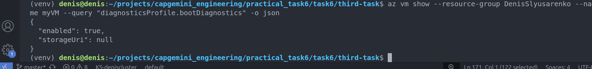

#### Practical Task 1: Install, Configure, and Manage Terraform State in Azure

#### Practical Task 2: Deploy an Azure Virtual Machine with a Custom Network and Security Rules

#### Practical Task 3: Implement a Scalable Infrastructure with Load Balancer and Auto Scaling

#### Practical Task 4: Install and Configure Ansible for Azure

#### Practical Task 5: Deploy an Azure Virtual Machine with Ansible

#### Practical Task 7: Deploy a Resource Group Using an ARM Template

#### Practical Task 8: Deploy an Azure Storage Account Using an ARM Template

#### Practical Task 9: Terraform: Deploy a Production-Ready AKS Cluster with GitOps & Secret Management & Monitoring

#### Practical Task 10: Deploy a Virtual Machine with Networking Using an ARM Template

#### Azure Bicep Tasks

.1.png)
.2.png)

#### Practical Task 11: Deploy a Multi-Resource Azure Infrastructure Using Bicep

#### Practical Task 13: Configure Azure Monitor to Track VM Metrics and Alerts

#### Practical Task 15: Enable Application Insights for a Web Application

#### Practical Task 16: Analyze Application Telemetry and Dependency Tracking

#### Practical Task 17: Query and Analyze Azure Logs with Kusto Query Language (KQL)

