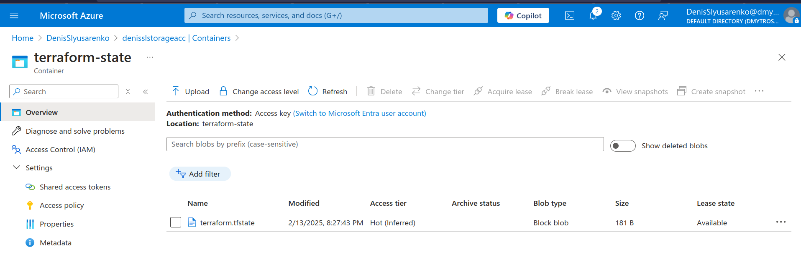

#### Practical Task 1: Install, Configure, and Manage Terraform State in Azure

#### Practical Task 2: Deploy an Azure Virtual Machine with a Custom Network and Security Rules

#### Practical Task 3: Implement a Scalable Infrastructure with Load Balancer and Auto Scaling

