#### Practical Task 1: Create and Initialize a New Repository with a README

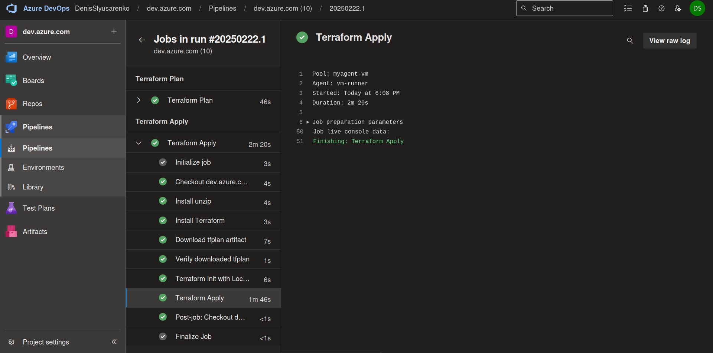


#### Practical Task 2: Implement Branching and Merging

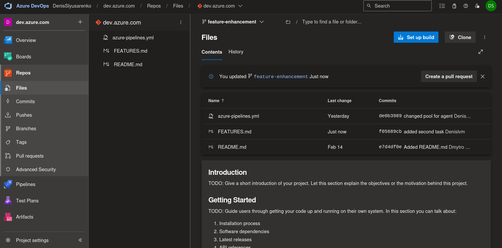
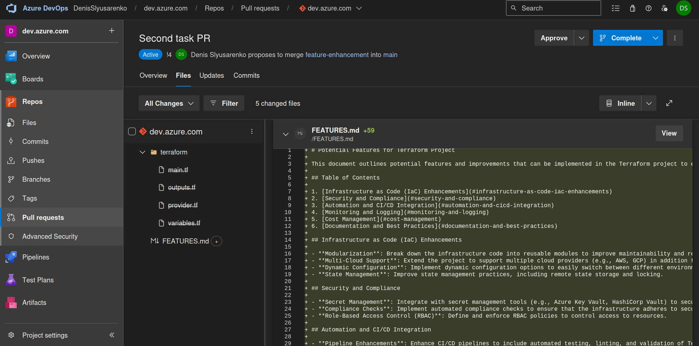
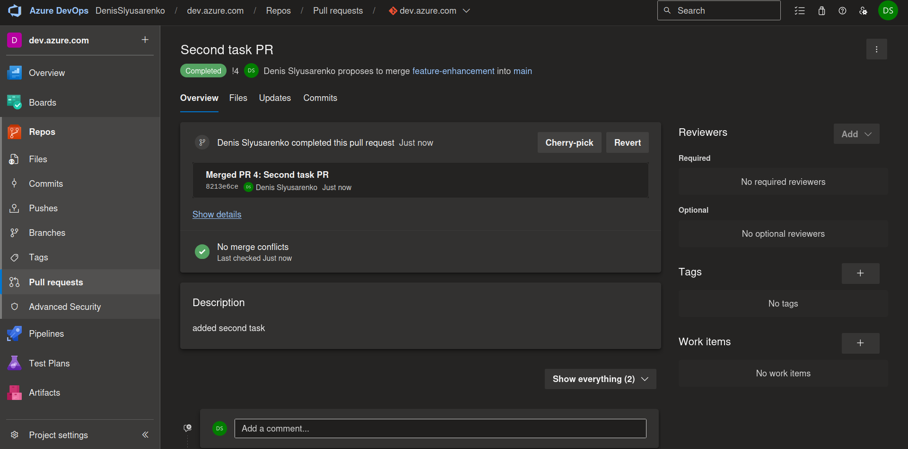

#### Practical Task 3: Set Up Branch Policies and Code Review

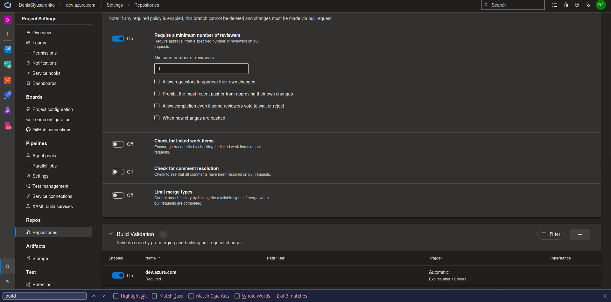
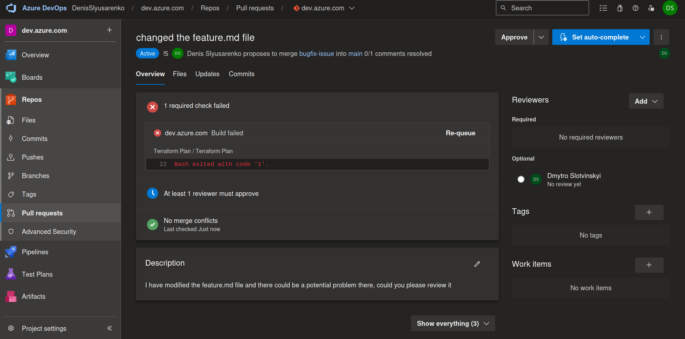

#### Practical Task 4: Create a Simple Build Pipeline in Azure DevOps

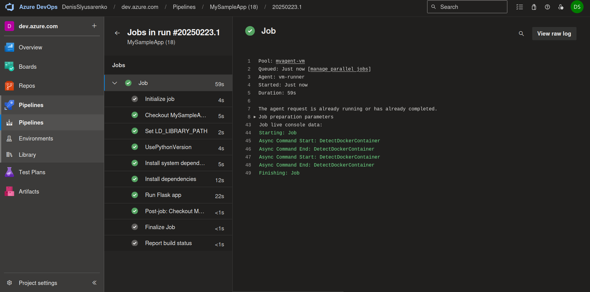

```yaml
trigger:
- main

pool:
  name: myagent-vm
  demands:
    - agent.name -equals vm-runner

steps:

- script: |
    echo "##vso[task.setvariable variable=LD_LIBRARY_PATH;]:/home/denis/myagent/_work/_tool/Python/3.11.11/x64/lib/"
  displayName: 'Set LD_LIBRARY_PATH'

- task: UsePythonVersion@0
  inputs:
    versionSpec: '3.11.11'
    addToPath: true

- script: |
    sudo apt update
    sudo apt install -y libselinux1-dev build-essential
  displayName: 'Install system dependencies'

- script: |
    python -m venv venv
    source venv/bin/activate
    pip install --upgrade pip
    pip install -r requirements.txt
  displayName: 'Install dependencies'

- script: |
    source venv/bin/activate
    flask run --host=0.0.0.0 --port=5000 &
    sleep 5  # Give the server some time to start
    curl http://localhost:5000
  displayName: 'Run Flask app'
```

#### Practical Task 5: Set Up Continuous Deployment (CD) to Azure Web App

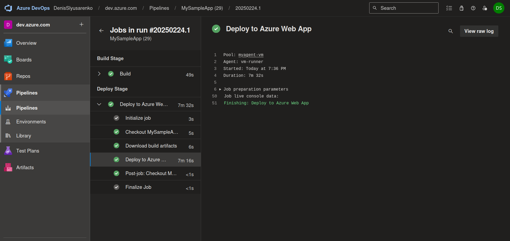
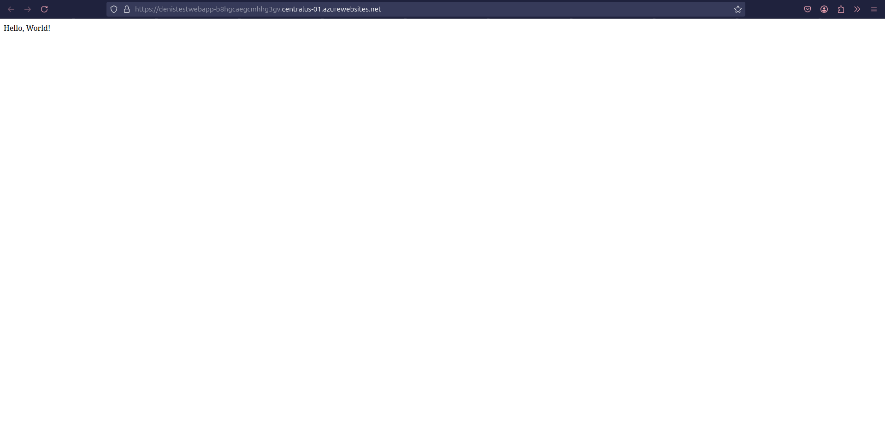

#### Practical Task 6: Implement CI/CD with GitHub and Azure Pipelines

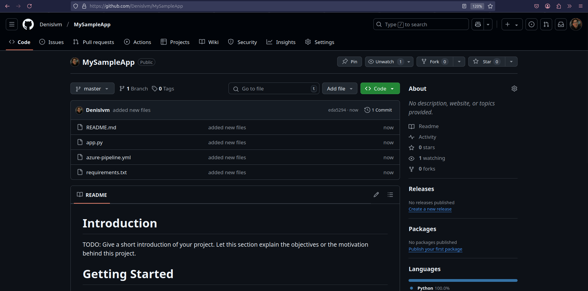
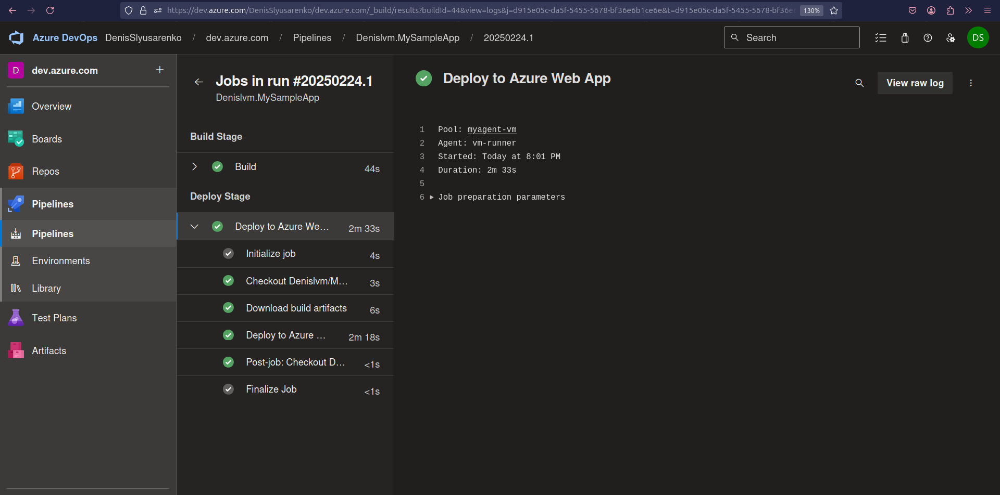

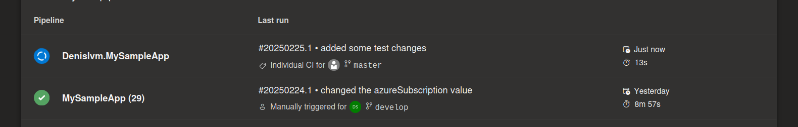
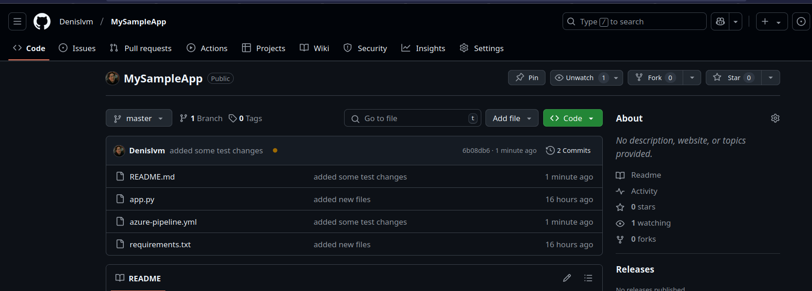

#### Practical Task 7: Use Azure Artifacts to Manage Dependencies

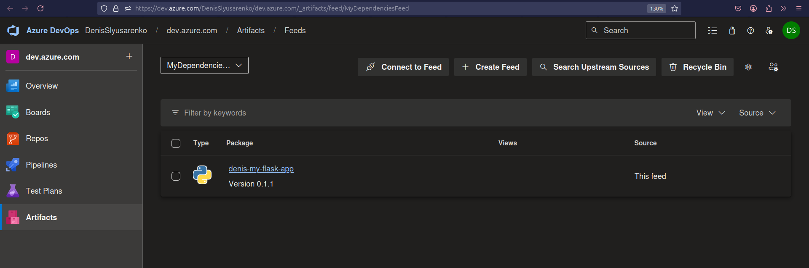
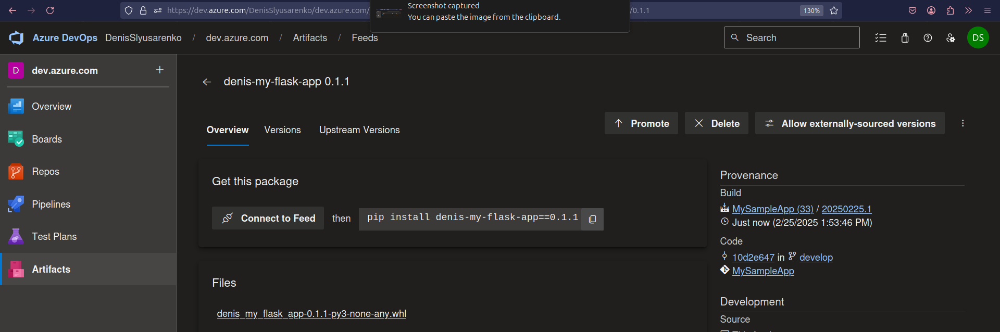

```
trigger:
- main

pool:
  name: myagent-vm
  demands:
    - agent.name -equals vm-runner

variables:
  - group: "MyVariableGroup"
  - name: 'ArtifactsFeedName'
    value: 'MyDependenciesFeed'
  - name: 'PythonVersion'
    value: '3.11.11'

stages:
- stage: Build
  displayName: 'Build Stage'
  jobs:
    - job: Build
      steps:
      - script: |
          echo "##vso[task.setvariable variable=LD_LIBRARY_PATH;]:/home/denis/myagent/_work/_tool/Python/3.11.11/x64/lib/"
        displayName: 'Set LD_LIBRARY_PATH'

      - task: UsePythonVersion@0
        inputs:
          versionSpec: '$(PythonVersion)'
          addToPath: true

      - script: |
          sudo apt update
          sudo apt install -y libselinux1-dev build-essential zip
        displayName: 'Install system dependencies'

      # Install Twine for publishing and setup tools for packaging
      - script: |
          python -m venv venv
          source venv/bin/activate
          pip install --upgrade pip
          pip install twine build wheel
          pip install -r requirements.txt
        displayName: 'Install dependencies and packaging tools'

      # Build Python package
      # - script: |
      #     source venv/bin/activate
      #     python -m build --wheel
      #   displayName: 'Build Python package'
      #   workingDirectory: '$(System.DefaultWorkingDirectory)'

      # Publish to Azure Artifacts
      # - script: |
      #     source venv/bin/activate
      #     python -m twine upload \
      #     --repository-url https://pkgs.dev.azure.com/DenisSlyusarenko/dev.azure.com/_packaging/$(ArtifactsFeedName)/pypi/upload/ \
      #           dist/* \
      #       --username "Azure DevOps" \
      #       --password $(System.AccessToken)
      #   displayName: 'Publish to Azure Artifacts'
      #   workingDirectory: '$(System.DefaultWorkingDirectory)'

      # Install dependencies from Azure Artifacts
      # - script: |
      #     source venv/bin/activate
      #     echo "[global]" > pip.conf
      #     echo "index-url = https://pkgs.dev.azure.com/$(System.TeamProject)/_packaging/$(ArtifactsFeedName)/pypi/simple/" >> pip.conf
      #     PIP_CONFIG_FILE=pip.conf pip install -r requirements.txt
      #   displayName: 'Restore dependencies from Azure Artifacts'

      - task: ArchiveFiles@2
        displayName: 'Archive Flask app'
        inputs:
          rootFolderOrFile: '$(System.DefaultWorkingDirectory)'
          includeRootFolder: false
          archiveType: 'zip'
          archiveFile: '$(Build.ArtifactStagingDirectory)/flask-app.zip'
          replaceExistingArchive: true
  
      - task: PublishBuildArtifacts@1
        displayName: 'Publish artifacts'
        inputs:
          pathToPublish: '$(Build.ArtifactStagingDirectory)'
          artifactName: 'flask-app'
          publishLocation: 'Container'

      # - script: |
      #     python -m venv venv
      #     source venv/bin/activate
      #     pip install --upgrade pip
      #     echo "[global]" > pip.conf
      #     echo "index-url = https://pkgs.dev.azure.com/$(System.TeamProject)/_packaging/$(ArtifactsFeedName)/pypi/simple/" >> pip.conf
      #     PIP_CONFIG_FILE=pip.conf pip install -r requirements.txt
      # displayName: 'Restore dependencies from feed'
```
#### Practical Task 8: Deploy Infrastructure as Code (IaC) with Bicep

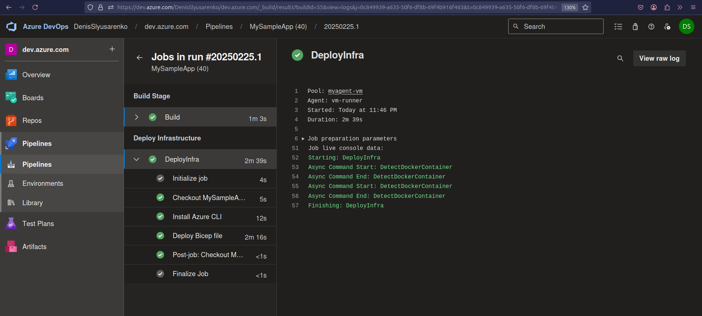
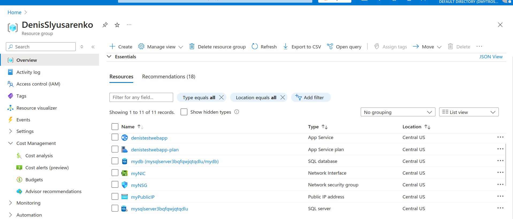

```
trigger:
- main

pool:
  name: myagent-vm
  demands:
    - agent.name -equals vm-runner

variables:
  - group: "MyVariableGroup"
  - name: 'ArtifactsFeedName'
    value: 'MyDependenciesFeed'
  - name: 'PythonVersion'
    value: '3.11.11'

stages:
- stage: Build
  displayName: 'Build Stage'
  jobs:
    - job: Build
      steps:
      - script: |
          echo "##vso[task.setvariable variable=LD_LIBRARY_PATH;]:/home/denis/myagent/_work/_tool/Python/3.11.11/x64/lib/"
        displayName: 'Set LD_LIBRARY_PATH'

      - task: UsePythonVersion@0
        inputs:
          versionSpec: '$(PythonVersion)'
          addToPath: true

      - script: |
          sudo apt update
          sudo apt install -y libselinux1-dev build-essential zip
        displayName: 'Install system dependencies'

      - script: |
          python -m venv venv
          source venv/bin/activate
          pip install --upgrade pip
          pip install twine build wheel
          pip install -r requirements.txt
        displayName: 'Install dependencies and packaging tools'

      - task: ArchiveFiles@2
        displayName: 'Archive Flask app'
        inputs:
          rootFolderOrFile: '$(System.DefaultWorkingDirectory)'
          includeRootFolder: false
          archiveType: 'zip'
          archiveFile: '$(Build.ArtifactStagingDirectory)/flask-app.zip'
          replaceExistingArchive: true
  
      - task: PublishBuildArtifacts@1
        displayName: 'Publish artifacts'
        inputs:
          pathToPublish: '$(Build.ArtifactStagingDirectory)'
          artifactName: 'flask-app'
          publishLocation: 'Container'


- stage: Deploy
  displayName: 'Deploy Infrastructure'
  dependsOn: Build
  jobs:
    - job: DeployInfra
      steps:

      - script: |
          sudo apt-get update
          sudo apt-get install -y curl
          curl -sL https://aka.ms/InstallAzureCLIDeb | sudo bash
        displayName: 'Install Azure CLI'

      - task: AzureCLI@2
        displayName: 'Deploy Bicep file'
        inputs:
          azureSubscription: 'denistestwebapp' 
          scriptType: 'bash'
          scriptLocation: 'inlineScript'
          inlineScript: |
            az deployment group create \
              --resource-group $(resource_group) \
              --template-file main.bicep
```

#### Practical Task 9: Implement Infrastructure as Code (IaC) with Terraform

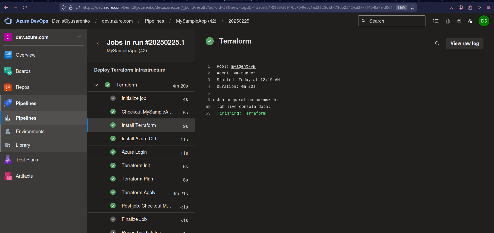
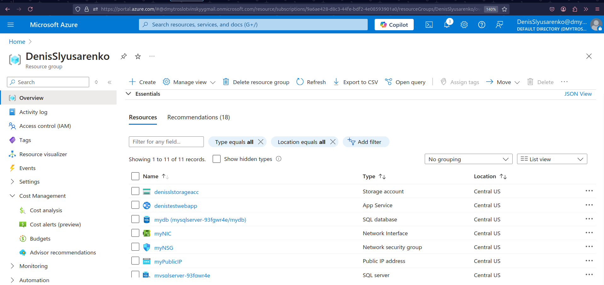

```
trigger:
  branches:
    include:
      - main
  paths:
    include:
      - '*.tf'

pool:
  name: myagent-vm
  demands:
    - agent.name -equals vm-runner

variables:
  - group: "MyVariableGroup"

stages:
- stage: TerraformDeploy
  displayName: 'Deploy Terraform Infrastructure'
  jobs:
    - job: Terraform
      steps:
      # Install Terraform
      - script: |
          sudo apt-get update
          sudo apt-get install -y wget unzip
          wget https://releases.hashicorp.com/terraform/1.10.5/terraform_1.10.5_linux_amd64.zip
          unzip terraform_1.10.5_linux_amd64.zip
          sudo mv terraform /usr/local/bin/
          terraform --version
        displayName: 'Install Terraform'

      # Install Azure CLI (needed for authentication)
      - script: |
          sudo apt-get update
          sudo apt-get install -y curl
          curl -sL https://aka.ms/InstallAzureCLIDeb | sudo bash
          az --version
        displayName: 'Install Azure CLI'

      # Login to Azure (using service principal or other credentials)
      - task: AzureCLI@2
        displayName: 'Azure Login'
        inputs:
          azureSubscription: $(denistestwebapp)  # Replace with your service connection
          scriptType: 'bash'
          scriptLocation: 'inlineScript'
          inlineScript: |
            az login --service-principal -u $(client_id) -p $(client_secret) --tenant $(tenant_id)

      # Terraform Init
      - script: |
          terraform init
        displayName: 'Terraform Init'
        workingDirectory: '$(System.DefaultWorkingDirectory)'
        env:
          ARM_CLIENT_ID: $(client_id)
          ARM_CLIENT_SECRET: $(client_secret)
          ARM_TENANT_ID: $(tenant_id)
          ARM_SUBSCRIPTION_ID: $(subscription_id)  # Add this if not already in your variable group

      - script: |
          terraform plan -out=tfplan
        displayName: 'Terraform Plan'
        workingDirectory: '$(System.DefaultWorkingDirectory)'
        env:
          ARM_CLIENT_ID: $(client_id)
          ARM_CLIENT_SECRET: $(client_secret)
          ARM_TENANT_ID: $(tenant_id)
          ARM_SUBSCRIPTION_ID: $(subscription_id)

      - script: |
          terraform apply -auto-approve tfplan
        displayName: 'Terraform Apply'
        workingDirectory: '$(System.DefaultWorkingDirectory)'
        env:
          ARM_CLIENT_ID: $(client_id)
          ARM_CLIENT_SECRET: $(client_secret)
          ARM_TENANT_ID: $(tenant_id)
          ARM_SUBSCRIPTION_ID: $(subscription_id)
```

#### Practical Task 10: Integrate Azure Test Plans with CI/CD Pipelines

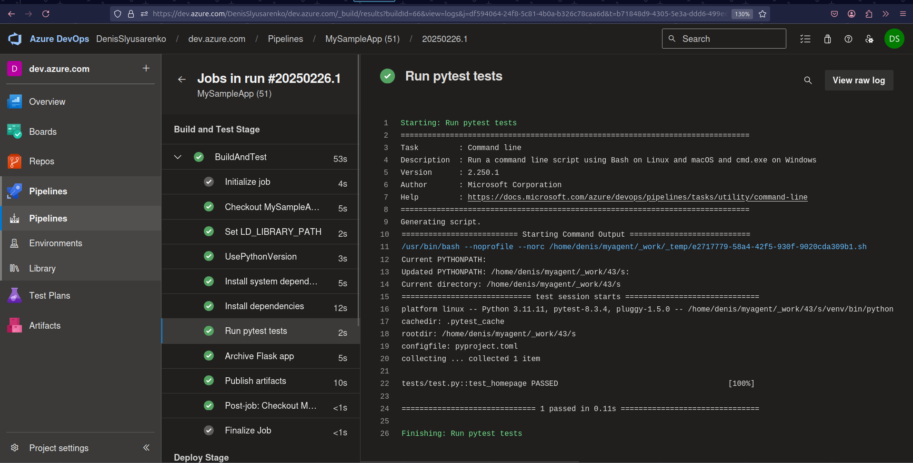
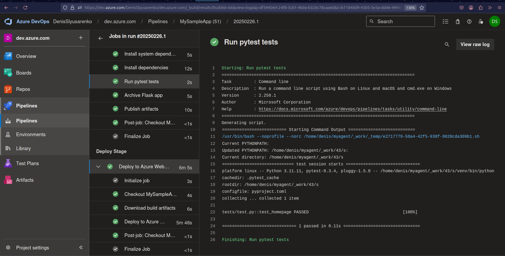

```
trigger:
- master

pool:
  name: myagent-vm
  demands:
    - agent.name -equals vm-runner

variables:
  - group: "MyVariableGroup"

stages:
- stage: BuildAndTest
  displayName: 'Build and Test Stage'
  jobs:
    - job: BuildAndTest
      steps:
      - script: |
          echo "##vso[task.setvariable variable=LD_LIBRARY_PATH;]:/home/denis/myagent/_work/_tool/Python/3.11.11/x64/lib/"
        displayName: 'Set LD_LIBRARY_PATH'

      - task: UsePythonVersion@0
        inputs:
          versionSpec: '3.11.11'
          addToPath: true

      - script: |
          sudo apt update
          sudo apt install -y libselinux1-dev build-essential zip
        displayName: 'Install system dependencies'

      - script: |
          python -m venv venv
          source venv/bin/activate
          pip install --upgrade pip
          pip install -r requirements.txt
        displayName: 'Install dependencies'

      - script: |
          source venv/bin/activate
          echo "Current PYTHONPATH: $PYTHONPATH"
          export PYTHONPATH=$(System.DefaultWorkingDirectory):$PYTHONPATH
          echo "Updated PYTHONPATH: $PYTHONPATH"
          echo "Current directory: $(pwd)"
          python -m pytest tests/test.py --verbose
        displayName: 'Run pytest tests'
        workingDirectory: '$(System.DefaultWorkingDirectory)'
        continueOnError: false

      - task: ArchiveFiles@2
        displayName: 'Archive Flask app'
        inputs:
          rootFolderOrFile: '$(System.DefaultWorkingDirectory)'
          includeRootFolder: false
          archiveType: 'zip'
          archiveFile: '$(Build.ArtifactStagingDirectory)/flask-app.zip'
          replaceExistingArchive: true
  
      - task: PublishBuildArtifacts@1
        displayName: 'Publish artifacts'
        inputs:
          pathToPublish: '$(Build.ArtifactStagingDirectory)'
          artifactName: 'flask-app'
          publishLocation: 'Container'

- stage: Deploy
  displayName: 'Deploy Stage'
  dependsOn: BuildAndTest
  condition: succeeded()
  jobs:
  - job: DeployJob
    displayName: 'Deploy to Azure Web App'
    steps:
    - task: DownloadBuildArtifacts@1
      displayName: 'Download build artifacts'
      inputs:
        buildType: 'current'
        downloadType: 'single'
        artifactName: 'flask-app'
        downloadPath: '$(System.DefaultWorkingDirectory)'
```