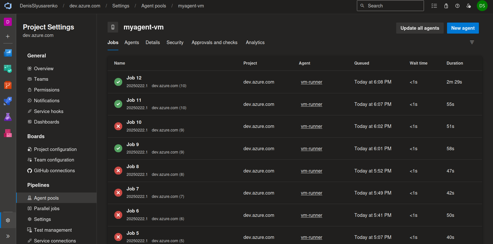

#### Practical Task 1: Create and Initialize a New Repository with a README




#### Practical Task 2: Implement Branching and Merging


#### Practical Task 3: Set Up Branch Policies and Code Review


#### Practical Task 4: Create a Simple Build Pipeline in Azure DevOps


```yaml
trigger:
- main

pool:
  name: myagent-vm
  demands:
    - agent.name -equals vm-runner

steps:

- script: |
    echo "##vso[task.setvariable variable=LD_LIBRARY_PATH;]:/home/denis/myagent/_work/_tool/Python/3.11.11/x64/lib/"
  displayName: 'Set LD_LIBRARY_PATH'

- task: UsePythonVersion@0
  inputs:
    versionSpec: '3.11.11'
    addToPath: true

- script: |
    sudo apt update
    sudo apt install -y libselinux1-dev build-essential
  displayName: 'Install system dependencies'

- script: |
    python -m venv venv
    source venv/bin/activate
    pip install --upgrade pip
    pip install -r requirements.txt
  displayName: 'Install dependencies'

- script: |
    source venv/bin/activate
    flask run --host=0.0.0.0 --port=5000 &
    sleep 5  # Give the server some time to start
    curl http://localhost:5000
  displayName: 'Run Flask app'
```
